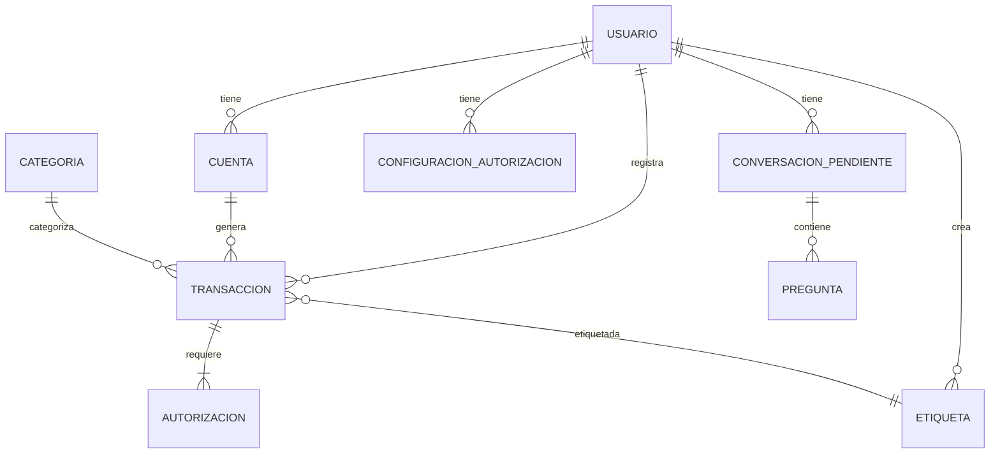
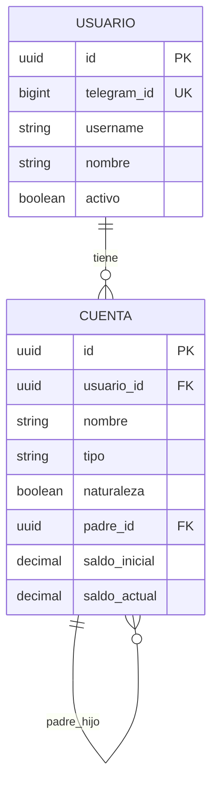
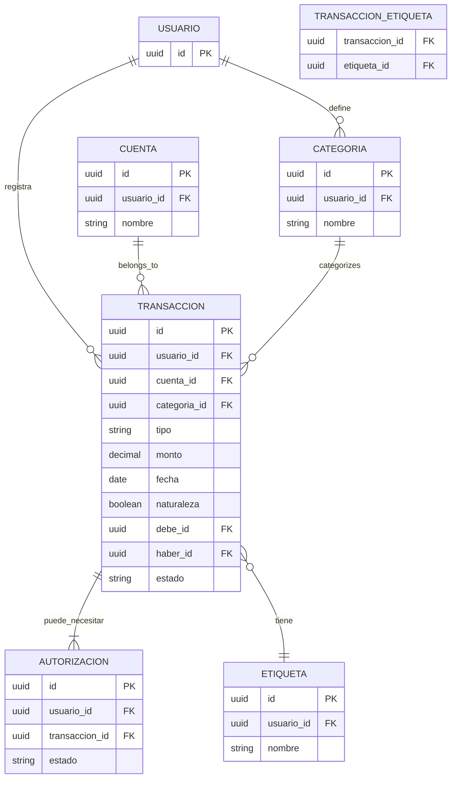
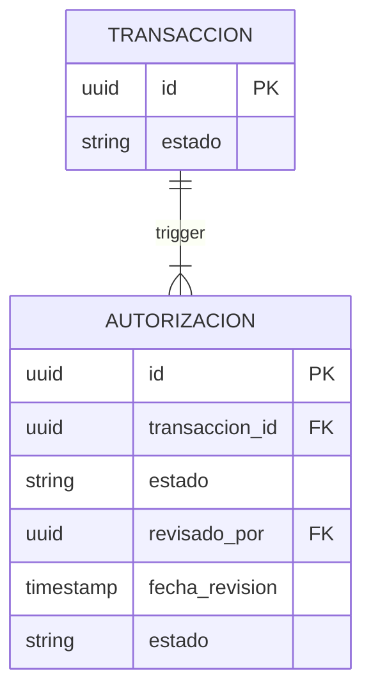
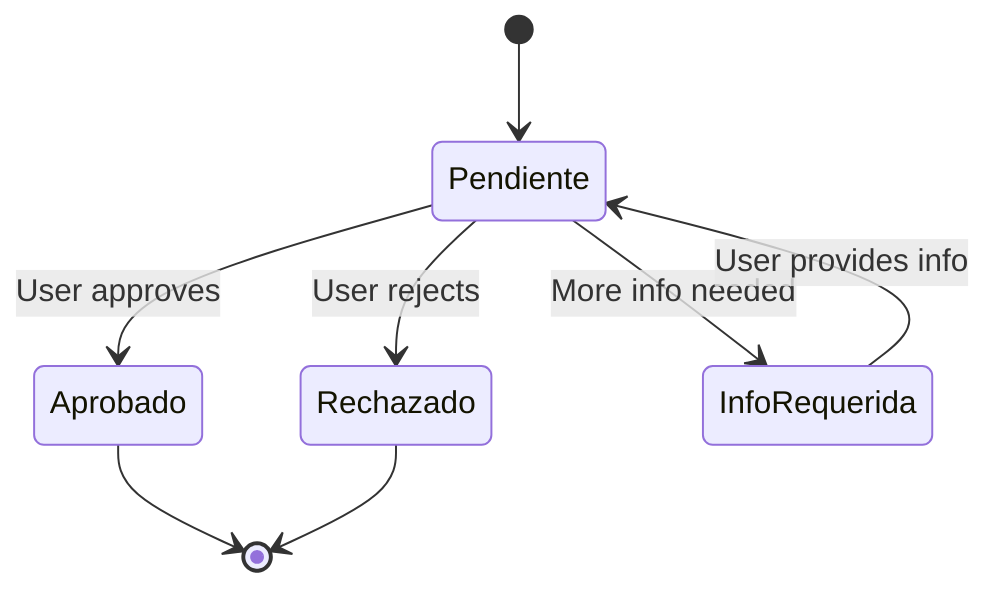
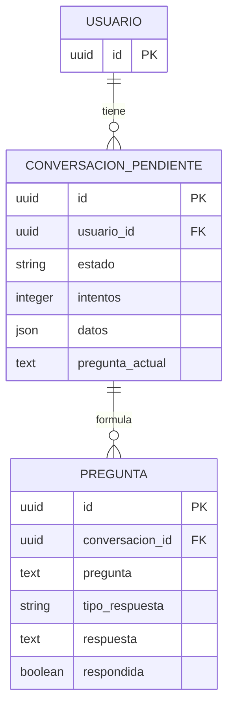
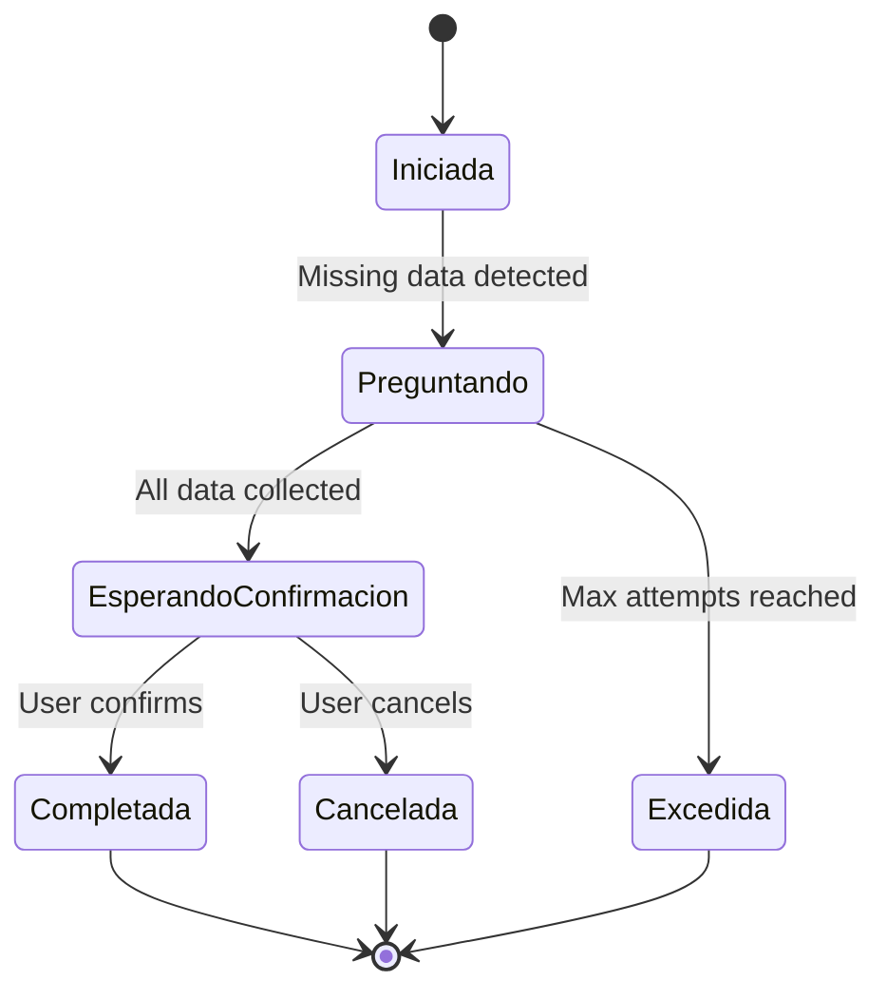
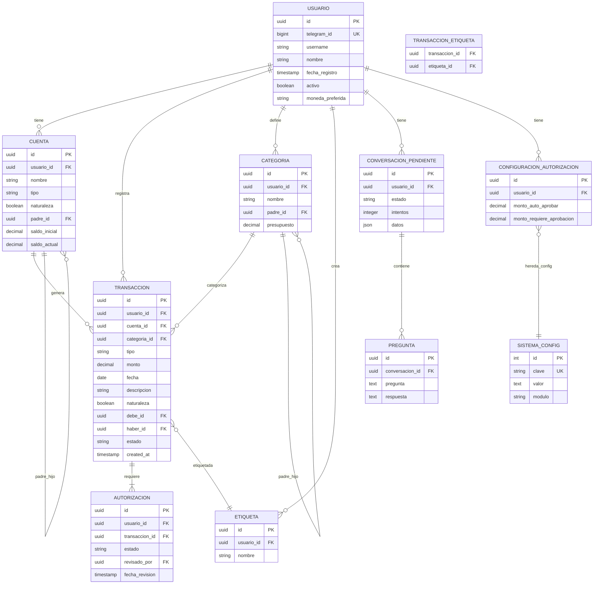
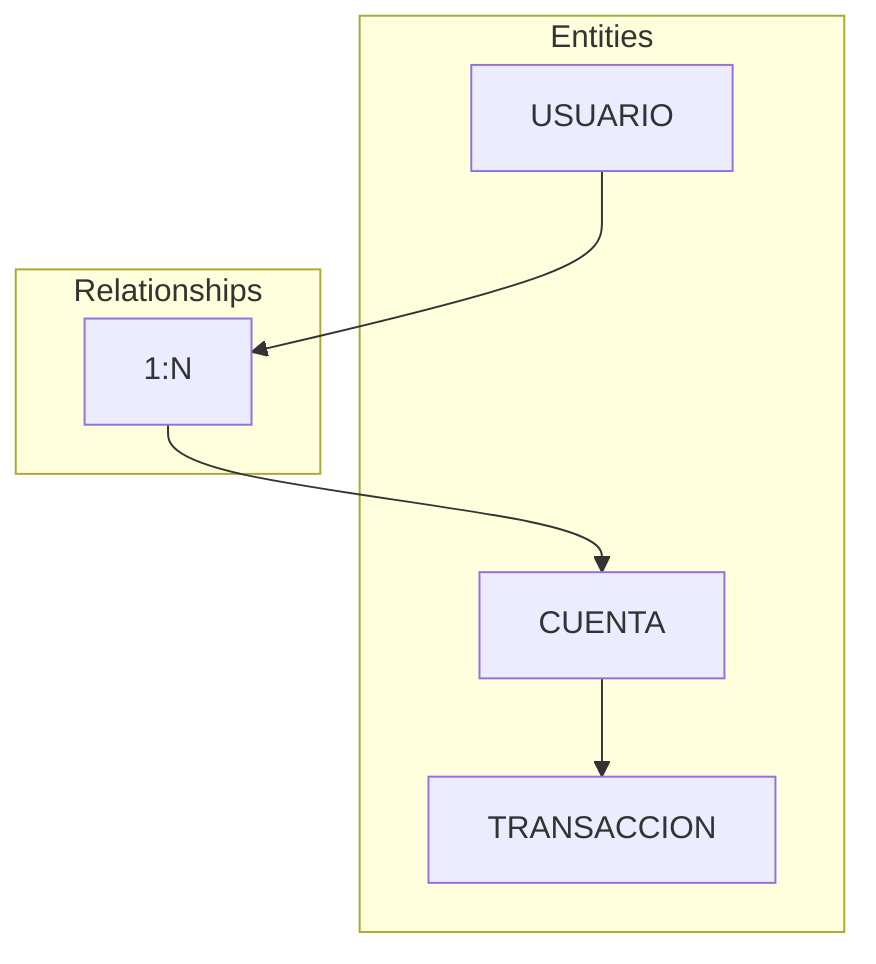

# Entity-Relationship Diagram - MyFinance 4.0

Visual representation of the database schema relationships.

---

## 1. Core Entity Relationships

### 1.1 Main Entities



---

## 2. User & Account Hierarchy

### 2.1 User to Account Relationship



---

## 3. Transaction Flow

### 3.1 Complete Transaction Lifecycle



---

## 4. Authorization Workflow

### 4.1 Purgatorio States



**State Transition:**


---

## 5. Interactive Conversation Flow

### 5.1 Conversacion Pendiente States



**State Machine:**


---

## 6. Configuration System

### 6.1 System Configuration

```mermaid
erDiagram
    SISTEMA_CONFIG {
        int id PK
        string clave UK
        text valor
        string descripcion
        string modulo
        boolean activo
    }
    
    USUARIO {
        uuid id PK
        json config
    }
    
    CONFIGURACION_AUTORIZACION {
        uuid id PK
        uuid usuario_id FK UK
        decimal monto_auto_aprobar
        decimal monto_requiere_aprobacion
    }
    
    SISTEMA_CONFIG ||--|| CONFIGURACION_AUTORIZACION : comparte_esquema
    USUARIO ||--|| CONFIGURACION_AUTORIZACION : define_reglas
```

---

## 7. Complete ERD

### 7.1 Full Database Diagram



---

## 8. Relationship Details

### 8.1 Cardinality Summary

| Relationship | Type | Description |
|--------------|------|-------------|
| USUARIO → CUENTA | 1:N | User can have multiple accounts |
| USUARIO → TRANSACCION | 1:N | User can have many transactions |
| CUENTA → TRANSACCION | 1:N | Account can have many transactions |
| CATEGORIA → TRANSACCION | 1:N | Category can have many transactions |
| TRANSACCION → AUTORIZACION | 1:1 | Transaction may need authorization |
| TRANSACCION → ETIQUETA | N:M | Transaction can have multiple tags |
| USUARIO → CONVERSACION_PENDIENTE | 1:N | User can have pending conversations |
| CONVERSACION_PENDIENTE → PREGUNTA | 1:N | Conversation has many questions |

### 8.2 Cascade Rules

| Parent Table | Child Table | On Delete |
|--------------|-------------|-----------|
| USUARIO | CUENTA | CASCADE |
| USUARIO | TRANSACCION | CASCADE |
| USUARIO | CATEGORIA | CASCADE |
| USUARIO | CONVERSACION_PENDIENTE | CASCADE |
| CUENTA | TRANSACCION | SET NULL |
| CATEGORIA | TRANSACCION | SET NULL |
| TRANSACCION | AUTORIZACION | CASCADE |
| CONVERSACION_PENDIENTE | PREGUNTA | CASCADE |

---

## 9. Index Strategy

### 9.1 Primary Indexes

| Table | Index | Type | Columns |
|-------|-------|------|---------|
| USUARIO | pk_usuario | PRIMARY | id |
| CUENTA | pk_cuenta | PRIMARY | id |
| TRANSACCION | pk_transaccion | PRIMARY | id |
| CATEGORIA | pk_categoria | PRIMARY | id |

### 9.2 Secondary Indexes

| Table | Index | Type | Columns |
|-------|-------|------|---------|
| USUARIO | idx_telegram | UNIQUE | telegram_id |
| TRANSACCION | idx_fecha_usuario | COMPOSITE | fecha, usuario_id |
| TRANSACCION | idx_estado | INDEX | estado |
| CONVERSACION_PENDIENTE | idx_estado_usuario | COMPOSITE | estado, usuario_id |
| AUTORIZACION | idx_estado | INDEX | estado |

---

## 10. Visual Legend



| Symbol | Meaning |
|--------|---------|
| PK | Primary Key |
| FK | Foreign Key |
| UK | Unique Key |
| 1:1 | One to One |
| 1:N | One to Many |
| N:M | Many to Many |

---

## Related Documentation

- [Database Schemas](./schemas.md) - Detailed table definitions
- [Routes](../flows/routes.md) - How data is used in processing
- [System Design](../architecture/system-design.md) - Architecture overview

---

*Last updated: 2026-03-31*
