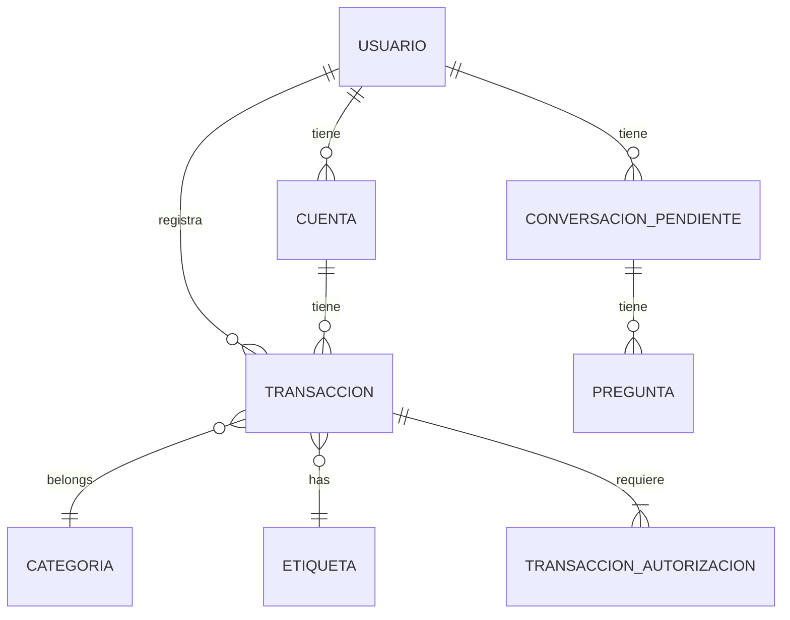

# Database Schemas - MyFinance 4.0

Documentation of the database table structures for MyFinance 4.0.

---

## 1. Schema Overview

### 1.1 Database Information

| Property | Value |
|----------|-------|
| Database | PostgreSQL |
| Version | 14+ |
| Encoding | UTF-8 |
| Timezone | UTC |

### 1.2 Core Tables



---

## 2. User & Authentication

### 2.1 usuarios (Users)

```sql
CREATE TABLE usuarios (
    id UUID PRIMARY KEY DEFAULT gen_random_uuid(),
    telegram_id BIGINT UNIQUE NOT NULL,
    username VARCHAR(255),
    nombre VARCHAR(255),
    fecha_registro TIMESTAMP DEFAULT CURRENT_TIMESTAMP,
    ultimo_acceso TIMESTAMP DEFAULT CURRENT_TIMESTAMP,
    config JSONB DEFAULT '{}',
    activo BOOLEAN DEFAULT TRUE,
    
    -- Preferences
    moneda_preferida VARCHAR(10) DEFAULT 'MXN',
    zona_horaria VARCHAR(50) DEFAULT 'America/Mexico_City',
    
    -- Security
    pin_seguridad VARCHAR(4),
    intentos_fallidos INTEGER DEFAULT 0,
    bloqueado_hasta TIMESTAMP
);

CREATE INDEX idx_usuarios_telegram ON usuarios(telegram_id);
CREATE INDEX idx_usuarios_activo ON usuarios(activo);
```

| Column | Type | Description |
|--------|------|-------------|
| `id` | UUID | Primary key |
| `telegram_id` | BIGINT | Telegram user ID (unique) |
| `username` | VARCHAR | Telegram username |
| `nombre` | VARCHAR | Display name |
| `fecha_registro` | TIMESTAMP | Registration date |
| `ultimo_acceso` | TIMESTAMP | Last access |
| `config` | JSONB | User preferences |
| `activo` | BOOLEAN | Active status |
| `moneda_preferida` | VARCHAR | Preferred currency |
| `zona_horaria` | VARCHAR | User timezone |
| `pin_seguridad` | VARCHAR | Security PIN |
| `intentos_fallidos` | INTEGER | Failed login attempts |
| `bloqueado_hasta` | TIMESTAMP | Lockout until |

---

## 3. Accounting

### 3.1 cuentas (Accounts)

```sql
CREATE TABLE cuentas (
    id UUID PRIMARY KEY DEFAULT gen_random_uuid(),
    usuario_id UUID REFERENCES usuarios(id) ON DELETE CASCADE,
    
    nombre VARCHAR(255) NOT NULL,
    tipo VARCHAR(50) NOT NULL, -- 'activo', 'pasivo', 'ingreso', 'gasto', 'patrimonio'
    naturaleza BOOLEAN NOT NULL, -- TRUE = credit increases, FALSE = debit increases
    padre_id UUID REFERENCES cuentas(id),
    
    saldo_inicial DECIMAL(15,2) DEFAULT 0,
    saldo_actual DECIMAL(15,2) DEFAULT 0,
    moneda VARCHAR(10) DEFAULT 'MXN',
    
    color VARCHAR(7), -- Hex color
    icono VARCHAR(50),
    descripcion TEXT,
    
    -- Alias support for multiple names/synonyms
    alias TEXT[] DEFAULT '{}',
    
    -- Metadata
    created_at TIMESTAMP DEFAULT CURRENT_TIMESTAMP,
    updated_at TIMESTAMP DEFAULT CURRENT_TIMESTAMP,
    activa BOOLEAN DEFAULT TRUE,
    
    -- Constraints
    CONSTRAINT ck_cuenta_tipo CHECK (tipo IN ('activo', 'pasivo', 'ingreso', 'gasto', 'patrimonio'))
);

CREATE INDEX idx_cuentas_usuario ON cuentas(usuario_id);
CREATE INDEX idx_cuentas_tipo ON cuentas(tipo);
CREATE INDEX idx_cuentas_padre ON cuentas(padre_id);
CREATE INDEX idx_cuentas_alias ON cuentas USING GIN(alias);
```

| Column | Type | Description |
|--------|------|-------------|
| `id` | UUID | Primary key |
| `usuario_id` | UUID | FK to usuarios |
| `nombre` | VARCHAR | Account name |
| `tipo` | VARCHAR | Account type |
| `naturaleza` | BOOLEAN | Credit increases / Debit increases |
| `padre_id` | UUID | Parent account (for hierarchy) |
| `saldo_inicial` | DECIMAL | Opening balance |
| `saldo_actual` | DECIMAL | Current balance |
| `moneda` | VARCHAR | Currency code |
| `color` | VARCHAR | Hex color code |
| `icono` | VARCHAR | Icon identifier |
| `descripcion` | TEXT | Account description |
| `alias` | TEXT[] | Array of alternative names/synonyms |
| `created_at` | TIMESTAMP | Creation timestamp |
| `updated_at` | TIMESTAMP | Last update timestamp |
| `activa` | BOOLEAN | Active status |

### 3.2 categorias (Categories)

```sql
CREATE TABLE categorias (
    id UUID PRIMARY KEY DEFAULT gen_random_uuid(),
    usuario_id UUID REFERENCES usuarios(id) ON DELETE CASCADE,
    
    nombre VARCHAR(255) NOT NULL,
    icono VARCHAR(50),
    color VARCHAR(7),
    padre_id UUID REFERENCES categorias(id),
    
    presupuesto DECIMAL(15,2),
    alerta_umbral DECIMAL(5,2), -- Percentage
    
    -- Alias support for multiple names/synonyms
    alias TEXT[] DEFAULT '{}',
    
    created_at TIMESTAMP DEFAULT CURRENT_TIMESTAMP,
    activa BOOLEAN DEFAULT TRUE
);

CREATE INDEX idx_categorias_usuario ON categorias(usuario_id);
CREATE INDEX idx_categorias_alias ON categorias USING GIN(alias);
```

### 3.3 transacciones (Transactions)

```sql
CREATE TABLE transacciones (
    id UUID PRIMARY KEY DEFAULT gen_random_uuid(),
    usuario_id UUID REFERENCES usuarios(id) ON DELETE CASCADE,
    cuenta_id UUID REFERENCES cuentas(id) ON DELETE SET NULL,
    categoria_id UUID REFERENCES categorias(id) ON DELETE SET NULL,
    
    -- Transaction data
    tipo VARCHAR(20) NOT NULL, -- 'ingreso', 'gasto', 'transferencia'
    monto DECIMAL(15,2) NOT NULL,
    fecha DATE NOT NULL,
    fecha_original VARCHAR(255), -- Original date string
    
    descripcion TEXT,
    proveedor VARCHAR(255), -- Vendor/Merchant
    
    -- Accounting
    naturaleza BOOLEAN NOT NULL, -- TRUE = credit, FALSE = debit
    debe_id UUID REFERENCES cuentas(id), -- For transferencias
    haber_id UUID REFERENCES cuentas(id), -- For transferencias
    
    -- TASK_PARSE v3 enhanced fields
    monto_impuesto DECIMAL(15,2), -- ITBIS/IVA if explicit
    monto_descuento DECIMAL(15,2), -- Discounts explicit
    monto_otros_cargos DECIMAL(15,2), -- Tips, shipping, commissions
    origen_raw VARCHAR(255), -- Original origin text from LLM
    destino_raw VARCHAR(255), -- Original destination text from LLM
    subtipo_registro VARCHAR(20), -- 'texto', 'imagen', 'archivo', 'mixto'
    
    -- OCR data (if from image)
    ocr_procesado BOOLEAN DEFAULT FALSE,
    ocr_datos JSONB,
    imagen_url TEXT,
    
    -- Status
    estado VARCHAR(20) DEFAULT 'confirmado', -- 'pendiente', 'confirmado', 'cancelado'
    
    -- Metadata
    created_at TIMESTAMP DEFAULT CURRENT_TIMESTAMP,
    updated_at TIMESTAMP DEFAULT CURRENT_TIMESTAMP,
    fuente VARCHAR(50) DEFAULT 'telegram', -- 'telegram', 'dashboard', 'api'
    
    -- Constraints
    CONSTRAINT ck_transaccion_tipo CHECK (tipo IN ('ingreso', 'gasto', 'transferencia')),
    CONSTRAINT ck_transaccion_estado CHECK (estado IN ('pendiente', 'confirmado', 'cancelado'))
);

CREATE INDEX idx_transacciones_usuario ON transacciones(usuario_id);
CREATE INDEX idx_transacciones_fecha ON transacciones(fecha);
CREATE INDEX idx_transacciones_cuenta ON transacciones(cuenta_id);
CREATE INDEX idx_transacciones_categoria ON transacciones(categoria_id);
CREATE INDEX idx_transacciones_estado ON transacciones(estado);
CREATE INDEX idx_transacciones_fecha_usuario ON transacciones(fecha, usuario_id);
```

| Column | Type | Description |
|--------|------|-------------|
| `id` | UUID | Primary key |
| `usuario_id` | UUID | FK to usuarios |
| `cuenta_id` | UUID | FK to cuentas |
| `categoria_id` | UUID | FK to categorias |
| `tipo` | VARCHAR | 'ingreso', 'gasto', 'transferencia' |
| `monto` | DECIMAL(15,2) | Total amount |
| `fecha` | DATE | Transaction date |
| `fecha_original` | VARCHAR | Original date string |
| `descripcion` | TEXT | Description |
| `proveedor` | VARCHAR | Vendor/Merchant |
| `naturaleza` | BOOLEAN | TRUE=credit, FALSE=debit |
| `debe_id` | UUID | For transfers (debit account) |
| `haber_id` | UUID | For transfers (credit account) |
| `monto_impuesto` | DECIMAL | ITBIS/IVA if explicit |
| `monto_descuento` | DECIMAL | Discounts explicit |
| `monto_otros_cargos` | DECIMAL | Tips, shipping, commissions |
| `origen_raw` | VARCHAR | Original origin text from LLM |
| `destino_raw` | VARCHAR | Original destination text from LLM |
| `subtipo_registro` | VARCHAR | 'texto', 'imagen', 'archivo', 'mixto' |
| `ocr_procesado` | BOOLEAN | OCR processed flag |
| `ocr_datos` | JSONB | OCR extracted data |
| `imagen_url` | TEXT | Image URL if from photo |
| `estado` | VARCHAR | 'pendiente', 'confirmado', 'cancelado' |
| `created_at` | TIMESTAMP | Creation timestamp |
| `updated_at` | TIMESTAMP | Last update |
| `fuente` | VARCHAR | 'telegram', 'dashboard', 'api' |

### 3.4 etiquetas (Tags)

```sql
CREATE TABLE etiquetas (
    id UUID PRIMARY KEY DEFAULT gen_random_uuid(),
    usuario_id UUID REFERENCES usuarios(id) ON DELETE CASCADE,
    nombre VARCHAR(100) NOT NULL,
    color VARCHAR(7),
    
    UNIQUE(usuario_id, nombre)
);

CREATE TABLE transacciones_etiquetas (
    transaccion_id UUID REFERENCES transacciones(id) ON DELETE CASCADE,
    etiqueta_id UUID REFERENCES etiquetas(id) ON DELETE CASCADE,
    PRIMARY KEY (transaccion_id, etiqueta_id)
);
```

---

## 4. Authorization Workflow

### 4.1 transacciones_autorizacion (Authorization Queue / Purgatorio)

```sql
CREATE TABLE transacciones_autorizacion (
    id UUID PRIMARY KEY DEFAULT gen_random_uuid(),
    usuario_id UUID REFERENCES usuarios(id) ON DELETE CASCADE,
    transaccion_id UUID REFERENCES transacciones(id) ON DELETE CASCADE,
    
    -- Authorization data
    estado VARCHAR(20) DEFAULT 'pendiente', -- 'pendiente', 'aprobado', 'rechazado', 'info_requerida'
    monto_umbral DECIMAL(15,2), -- Threshold that triggered authorization
    
    -- Review
    revisado_por UUID REFERENCES usuarios(id),
    fecha_revision TIMESTAMP,
    comentarios TEXT,
    
    -- Timestamps
    created_at TIMESTAMP DEFAULT CURRENT_TIMESTAMP,
    updated_at TIMESTAMP DEFAULT CURRENT_TIMESTAMP,
    
    -- Constraints
    CONSTRAINT ck_estado CHECK (estado IN ('pendiente', 'aprobado', 'rechazado', 'info_requerida'))
);

CREATE INDEX idx_autorizacion_usuario ON transacciones_autorizacion(usuario_id, estado);
CREATE INDEX idx_autorizacion_estado ON transacciones_autorizacion(estado);
```

### 4.2 User Authorization Settings

```sql
CREATE TABLE configuracion_autorizacion (
    id UUID PRIMARY KEY DEFAULT gen_random_uuid(),
    usuario_id UUID REFERENCES usuarios(id) ON DELETE CASCADE UNIQUE,
    
    -- Thresholds
    monto_auto_aprobar DECIMAL(15,2) DEFAULT 1000,
    monto_requiere_aprobacion DECIMAL(15,2) DEFAULT 5000,
    
    -- Category rules
    categorias_sin_aprobacion UUID[], -- Categories that don't need approval
    categorias_requieren_aprobacion UUID[], -- Categories that need approval
    
    -- Other users can approve
    approve_por TEXT[], -- Users who can approve on behalf
    
    created_at TIMESTAMP DEFAULT CURRENT_TIMESTAMP,
    updated_at TIMESTAMP DEFAULT CURRENT_TIMESTAMP
);
```

---

## 5. Interactive Conversations

### 5.1 conversacion_pendiente (Pending Conversations)

```sql
CREATE TABLE conversacion_pendiente (
    id UUID PRIMARY KEY DEFAULT gen_random_uuid(),
    usuario_id UUID REFERENCES usuarios(id) ON DELETE CASCADE,
    
    -- Conversation state
    estado VARCHAR(30) DEFAULT 'iniciada', -- 'iniciada', 'preguntando', 'esperando_confirmacion', 'completada', 'cancelada', 'excedida'
    intentos INTEGER DEFAULT 0,
    max_intentos INTEGER DEFAULT 5,
    
    -- Data collected
    datos JSONB DEFAULT '{}',
    datos_faltantes TEXT[], -- Fields still needed
    
    -- Current question
    pregunta_actual TEXT,
    
    -- Context
    ruta_anterior VARCHAR(10),
    ultimo_mensaje TEXT,
    
    -- Timestamps
    started_at TIMESTAMP DEFAULT CURRENT_TIMESTAMP,
    updated_at TIMESTAMP DEFAULT CURRENT_TIMESTAMP,
    completed_at TIMESTAMP
);

CREATE INDEX idx_conversacion_usuario ON conversacion_pendiente(usuario_id, estado);
CREATE INDEX idx_conversacion_estado ON conversacion_pendiente(estado);
```

### 5.2 preguntas (Questions for Interactive Flow)

```sql
CREATE TABLE preguntas (
    id UUID PRIMARY KEY DEFAULT gen_random_uuid(),
    conversacion_id UUID REFERENCES conversacion_pendiente(id) ON DELETE CASCADE,
    
    pregunta TEXT NOT NULL,
    tipo_respuesta VARCHAR(30), -- 'monto', 'fecha', 'categoria', 'cuenta', 'texto'
    respuesta TEXT,
    respondida BOOLEAN DEFAULT FALSE,
    
    orden INTEGER,
    created_at TIMESTAMP DEFAULT CURRENT_TIMESTAMP,
    respondida_at TIMESTAMP
);

CREATE INDEX idx_preguntas_conversacion ON preguntas(conversacion_id);
```

---

## 6. Configuration

### 6.1 sistema_config (System Configuration)

```sql
CREATE TABLE sistema_config (
    id SERIAL PRIMARY KEY,
    clave VARCHAR(100) UNIQUE NOT NULL,
    valor TEXT NOT NULL,
    descripcion TEXT,
    tipo VARCHAR(20) DEFAULT 'string', -- 'string', 'json', 'number', 'boolean'
    modulo VARCHAR(50), -- Which agent/module uses this
    
    -- Metadata
    activo BOOLEAN DEFAULT TRUE,
    created_at TIMESTAMP DEFAULT CURRENT_TIMESTAMP,
    updated_at TIMESTAMP DEFAULT CURRENT_TIMESTAMP,
    actualizado_por VARCHAR(255)
);

-- Default configuration entries
INSERT INTO sistema_config (clave, valor, descripcion, modulo) VALUES
('TASK_CLASSIFY', '...', 'Intent classification rules', 'A5'),
('TASK_PARSE', '...', 'Accounting JSON schema', 'A2'),
('TASK_ASK', '...', 'Missing entity detection', 'A2'),
('TASK_SQL', '...', 'Table structure and SQL rules', 'A3'),
('TASK_OCR', '...', 'OCR extraction guidelines', 'A1'),
('TASK_CHAT', '...', 'Chat personality and rules', 'A4');
```

### 6.2 logs_operaciones (Operation Logs)

```sql
CREATE TABLE logs_operaciones (
    id UUID PRIMARY KEY DEFAULT gen_random_uuid(),
    usuario_id UUID REFERENCES usuarios(id) ON DELETE SET NULL,
    
    -- Log data
    operacion VARCHAR(50) NOT NULL,
    modulo VARCHAR(50) NOT NULL, -- 'A1', 'A2', 'A3', 'A4', 'A5'
    parametros JSONB,
    resultado JSONB,
    exitosa BOOLEAN DEFAULT TRUE,
    
    -- Timing
    duracion_ms INTEGER,
    timestamp TIMESTAMP DEFAULT CURRENT_TIMESTAMP,
    
    -- Request info
    ip_address INET,
    user_agent TEXT
);

CREATE INDEX idx_logs_usuario ON logs_operaciones(usuario_id, timestamp);
CREATE INDEX idx_logs_modulo ON logs_operaciones(modulo, timestamp);
CREATE INDEX idx_logs_exitosa ON logs_operaciones(exitosa, timestamp);
```

---

## 7. Views & Aggregations

### 7.1 Vista: Balance por Cuenta

```sql
CREATE VIEW v_balance_cuentas AS
SELECT 
    u.id AS usuario_id,
    u.telegram_id,
    c.id AS cuenta_id,
    c.nombre AS cuenta,
    c.tipo,
    c.saldo_actual,
    c.moneda
FROM usuarios u
JOIN cuentas c ON c.usuario_id = u.id
WHERE c.activa = TRUE;
```

### 7.2 Vista: Gastos por Categoría (Mes Actual)

```sql
CREATE VIEW v_gastos_mes_categoria AS
SELECT 
    u.id AS usuario_id,
    c.id AS categoria_id,
    c.nombre AS categoria,
    SUM(t.monto) AS total,
    COUNT(*) AS transacciones
FROM usuarios u
JOIN transacciones t ON t.usuario_id = u.id
LEFT JOIN categorias c ON c.id = t.categoria_id
WHERE t.tipo = 'gasto'
    AND t.estado = 'confirmado'
    AND t.fecha >= DATE_TRUNC('month', CURRENT_DATE)
GROUP BY u.id, c.id, c.nombre;
```

---

## 8. Functions & Triggers

### 8.1 Trigger: Actualizar Saldo de Cuenta

```sql
CREATE OR REPLACE FUNCTION fn_actualizar_saldo_cuenta()
RETURNS TRIGGER AS $$
BEGIN
    -- Recalculate account balance
    UPDATE cuentas c
    SET saldo_actual = (
        SELECT COALESCE(SUM(
            CASE 
                WHEN t.naturaleza = TRUE THEN t.monto  -- Credit increases
                ELSE -t.monto  -- Debit decreases
            END
        ), 0)
        FROM transacciones t
        WHERE t.cuenta_id = c.id
            AND t.estado = 'confirmado'
    ) + c.saldo_inicial
    WHERE c.id = COALESCE(NEW.cuenta_id, OLD.cuenta_id);
    
    RETURN NEW;
END;
$$ LANGUAGE plpgsql;

CREATE TRIGGER tr_transaccion_saldo
AFTER INSERT OR UPDATE ON transacciones
FOR EACH ROW
EXECUTE FUNCTION fn_actualizar_saldo_cuenta();
```

### 8.2 Function: Movimiento entre Cuentas (Transferencia)

```sql
CREATE OR REPLACE FUNCTION fn_registrar_transferencia(
    p_usuario_id UUID,
    p_debe_id UUID,
    p_haber_id UUID,
    p_monto DECIMAL,
    p_fecha DATE,
    p_descripcion TEXT
) RETURNS UUID AS $$
DECLARE
    v_transaccion_id UUID;
BEGIN
    -- Debit (sale de cuenta)
    INSERT INTO transacciones (
        usuario_id, cuenta_id, tipo, monto, fecha, 
        descripcion, naturaleza, debe_id, haber_id
    ) VALUES (
        p_usuario_id, p_debe_id, 'transferencia', p_monto, p_fecha,
        p_descripcion, FALSE, p_debe_id, p_haber_id
    ) RETURNING id INTO v_transaccion_id;
    
    -- Credit (entra a cuenta)
    INSERT INTO transacciones (
        usuario_id, cuenta_id, tipo, monto, fecha,
        descripcion, naturaleza, debe_id, haber_id
    ) VALUES (
        p_usuario_id, p_haber_id, 'transferencia', p_monto, p_fedate,
        p_descripcion, TRUE, p_debe_id, p_haber_id
    );
    
    RETURN v_transaccion_id;
END;
$$ LANGUAGE plpgsql;
```

---

## 9. Security

### 9.1 Row Level Security (RLS)

```sql
-- Enable RLS on sensitive tables
ALTER TABLE usuarios ENABLE ROW LEVEL SECURITY;
ALTER TABLE cuentas ENABLE ROW LEVEL SECURITY;
ALTER TABLE transacciones ENABLE ROW LEVEL SECURITY;

-- Policy: Users can only see their own data
CREATE POLICY usuarios_policy ON usuarios
    FOR ALL USING (telegram_id = current_setting('app.user_telegram_id')::BIGINT);

CREATE POLICY cuentas_policy ON cuentas
    FOR ALL USING (usuario_id = (SELECT id FROM usuarios WHERE telegram_id = current_setting('app.user_telegram_id')::BIGINT));

CREATE POLICY transacciones_policy ON transacciones
    FOR ALL USING (usuario_id = (SELECT id FROM usuarios WHERE telegram_id = current_setting('app.user_telegram_id')::BIGINT));
```

---

## Related Documentation

- [ERD](./erd.md) - Entity-relationship diagrams
- [Routes](../flows/routes.md) - How data is used in routes
- [System Design](../architecture/system-design.md) - Architecture overview

---

*Last updated: 2026-04-01*
