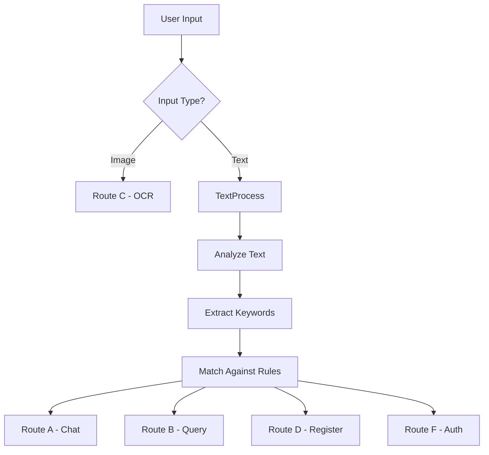
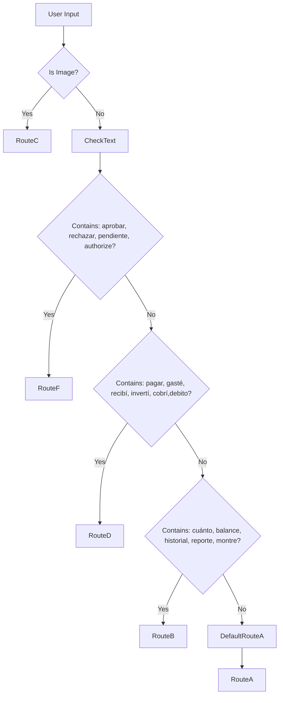
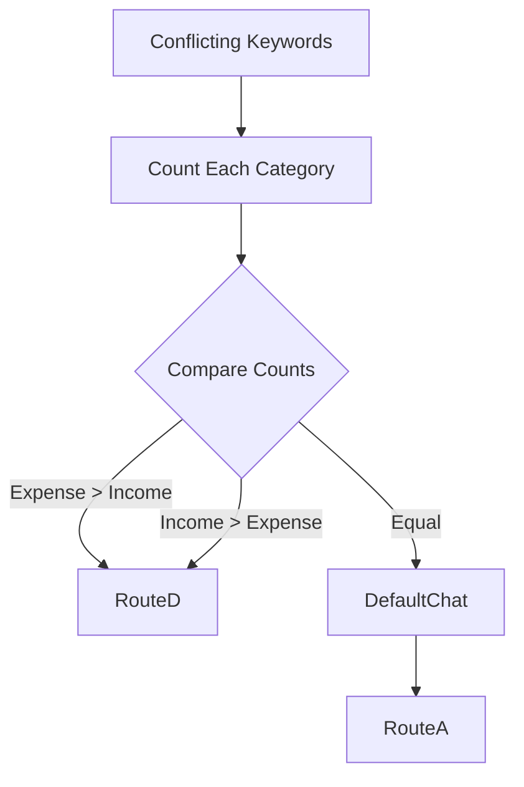
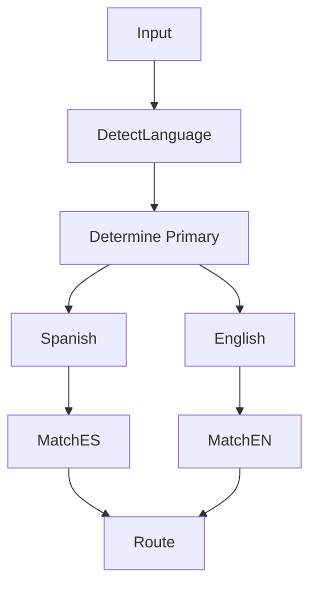
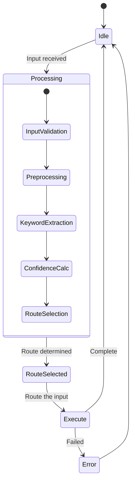
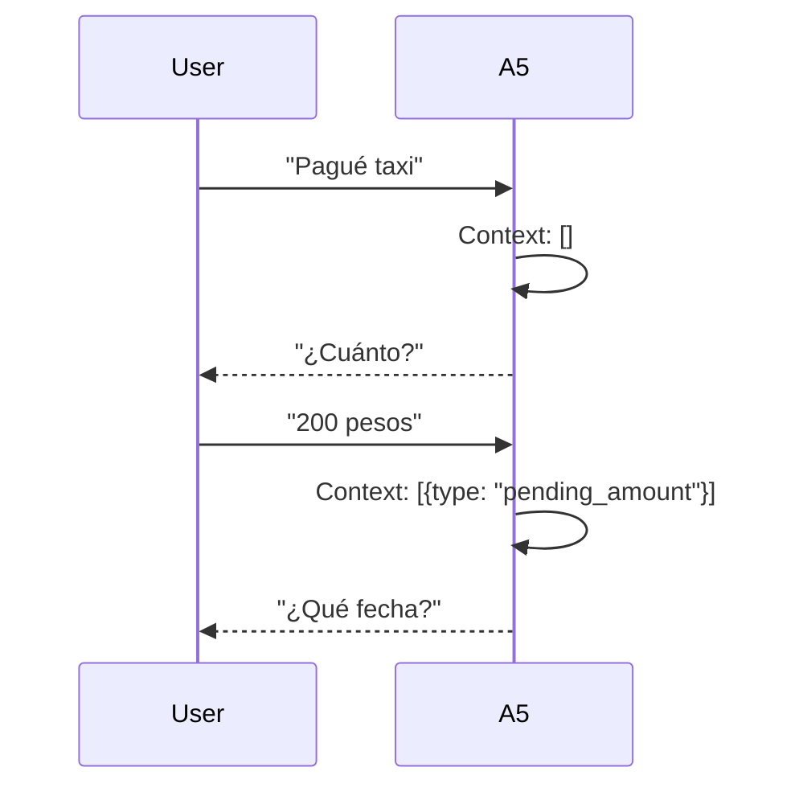

# Decision Trees - MyFinance 4.0

Documentation of the intent classification logic and decision trees used by Agent A5 (Classifier).

---

## 1. Classifier Overview

Agent A5 (Classifier) determines the appropriate processing route based on user input:



---

## 2. Decision Tree: Intent Classification

### 2.1 Main Decision Tree



### 2.2 Priority Rules

| Priority | Rule | Route | Confidence Boost |
|----------|------|-------|------------------|
| 1 | Image input | C | +0.2 |
| 2 | "aprobar" / "rechazar" / "pendiente" | F | +0.15 |
| 3 | Transaction keywords (pagar, gasté, etc.) | D | +0.1 |
| 4 | Query keywords (cuánto, balance, etc.) | B | +0.1 |
| 5 | Greeting / advice | A | Default |

### 2.3 Keyword Lists

#### Route F Keywords (Authorization)
```
aprobar, approve, confirmar, ok sí, ok si, aceptar, 
rechazar, reject, denegar, pendiente, pending, 
autorizar, authorization, approval
```

#### Route D Keywords (Registration - Expense)
```
pagar, pagué, gasté, gasté en, pagué, debí, debí,
compré, compré en, pagué por, pagué en, saqué,
saqué de, retiré, retiré de, efeticé, cobré
```

#### Route D Keywords (Registration - Income)
```
recibí, recebi, cobré, cobré de, income, salary,
sueldo, honorarios, devolución, reintegro,transferí,
me pagaron, me transferencia, depósito, depositó
```

#### Route B Keywords (Query)
```
cuánto, cuanto, balance, saldo, historial, reporte,
montre, muéstrame, dame, qué gasté, qué tengo,
cuál es, cómo está, análisis, estadísticas, totales,
suma, promedio, tendencias, tendencias
```

#### Route A Keywords (Chat)
```
hola, hello, hi, cómo estás, cómo estas, qué tal,
ayuda, help, consejos, tips, sugerencias, qué me
recomiendas, qué opinas, opinión, advice
```

---

## 3. Confidence Calculation

### 3.1 Confidence Formula

```
Confidence = Base + Keyword_Match + Context_Boost + Penalty

Where:
- Base = 0.5
- Keyword_Match = 0.1 per matched keyword (max 0.3)
- Context_Boost = 0.1 for context-aware matches
- Penalty = -0.1 for conflicting keywords
```

### 3.2 Confidence Thresholds

| Confidence | Action |
|------------|--------|
| **> 0.9** | Auto-route without confirmation |
| **0.7 - 0.9** | Route with notice to user |
| **0.5 - 0.7** | Route and ask for confirmation |
| **< 0.5** | Default to Route A (Chat) |

### 3.3 Confidence Examples

```
Input: "Pagué $500 en taxi"
  Keywords: "pagar" (+0.1), "$500" (+0.1), "taxi" (+0.1)
  Confidence: 0.5 + 0.3 = 0.8 → Route D (with notice)

Input: "Hola cómo estás?"
  Keywords: "hola" (+0.1), "cómo" (+0.1)
  Confidence: 0.5 + 0.2 = 0.7 → Route A (with notice)

Input: "Cuál es mi balance?"
  Keywords: "cuál" (+0.1), "balance" (+0.1)
  Confidence: 0.5 + 0.2 = 0.7 → Route B
```

---

## 4. Edge Case Handling

### 4.1 Ambiguous Inputs

```mermaid
flowchart TD
    Ambiguous[Ambiguous Input] --> CheckContext{Has Context?}
    
    CheckContext -->|Yes| UseContext[Use Previous Context]
    CheckContext -->|No| AskClarification
    
    AskClarification --> RouteA[Ask: "Querés registrar o consultar?"]
```

#### Ambiguous Examples

| Input | Ambiguity | Resolution |
|-------|-----------|------------|
| "$500" | Amount only, no context | Ask: "¿Gasto o ingreso?" |
| "Starbucks" | Vendor only | Ask: "¿Cuánto pagaste?" |
| "hola" | Could be greeting or start chat | Default to Chat |

### 4.2 Conflicting Keywords



| Input | Conflict | Resolution |
|-------|----------|------------|
| "Gasté y recibí $500" | Both expense and income | Ask clarification |

### 4.3 Mixed Language



The classifier supports both Spanish and English. Keywords work in both languages:
- Spanish: "pagar", "gasté", "cuánto"
- English: "pay", "spent", "how much"

---

## 5. State Machine: Classifier

### 5.1 Classifier States



### 5.2 State Descriptions

| State | Description | Actions |
|-------|-------------|---------|
| **Idle** | Waiting for input | None |
| **InputValidation** | Check input format | Validate type, length |
| **Preprocessing** | Normalize text | Lowercase, remove extra spaces |
| **KeywordExtraction** | Find keywords | Match against lists |
| **ConfidenceCalc** | Calculate confidence | Apply formula |
| **RouteSelection** | Choose route | Apply thresholds |
| **Execute** | Route to appropriate agent | Pass to next agent |

---

## 6. Context-Aware Decisions

### 6.1 Conversation Context

The classifier considers conversation history:



### 6.2 Context Variables

| Variable | Description | Persistence |
|----------|-------------|-------------|
| `last_route` | Previous route used | Current session |
| `pending_field` | Field being collected | Current interaction |
| `user_preferences` | Known preferences | Session |
| `recent_transactions` | Last 5 transactions | Current session |

### 6.3 Context Boost Examples

```
Scenario 1:
  User: "Pagué taxi" (missing amount)
  System: "¿Cuánto?"
  User: "200"
  Context: {pending_field: "monto"}
  
  → Classifier boosts confidence for Route D
  → Continues pending flow instead of starting new

Scenario 2:
  User: "Gasté $100" (complete)
  System: Registers successfully
  Context: {last_route: "D", last_amount: 100}
  
  → Next message "y también" triggers Route D with boost
```

---

## 7. Error Handling in Classifier

### 7.1 Failure Modes

| Error | Cause | Recovery |
|-------|-------|----------|
| Empty input | No text provided | Ask for input |
| Too long | Input exceeds limit | Truncate or ask to shorten |
| Encoding error | Invalid characters | Attempt decode, fallback |
| Model timeout | LLM takes too long | Default to Route A |

### 7.2 Fallback Behavior

```mermaid
flowchart TD
    Timeout[Classifier Timeout] --> DefaultRoute
    
    DefaultRoute --> RouteA[Route A - Chat]
    
    RouteA --> UserMessage[Message: "No entendí. ¿Podrías reformular?"]
```

When classifier fails:
1. Default to Route A (Chat)
2. User receives friendly clarification request
3. System logs error for review

---

## 8. Testing the Classifier

### 8.1 Test Cases

| Input | Expected Route | Confidence |
|-------|----------------|------------|
| "Hola" | A | 0.7 |
| "¿Cuánto gasté?" | B | 0.8 |
| "Pagué $50" | D | 0.8 |
| [Image] | C | 0.95 |
| "aprobar tx_1" | F | 0.9 |
| "ayúdame" | A | 0.6 |

### 8.2 Debug Mode

Enable debug mode to see classifier reasoning:

```
User: /debug on
System: Debug mode enabled

User: "Pagué taxi"
System: [
  "pagar": true,
  "confidence": 0.8,
  "route": "D",
  "keywords_matched": ["pagar", "taxi"]
]
```

---

## Related Documentation

- [Routes](./routes.md) - Route details
- [User Flows](./user-flows.md) - User interaction patterns
- [System Design](../architecture/system-design.md) - Architecture overview

---

*Last updated: 2026-03-31*
