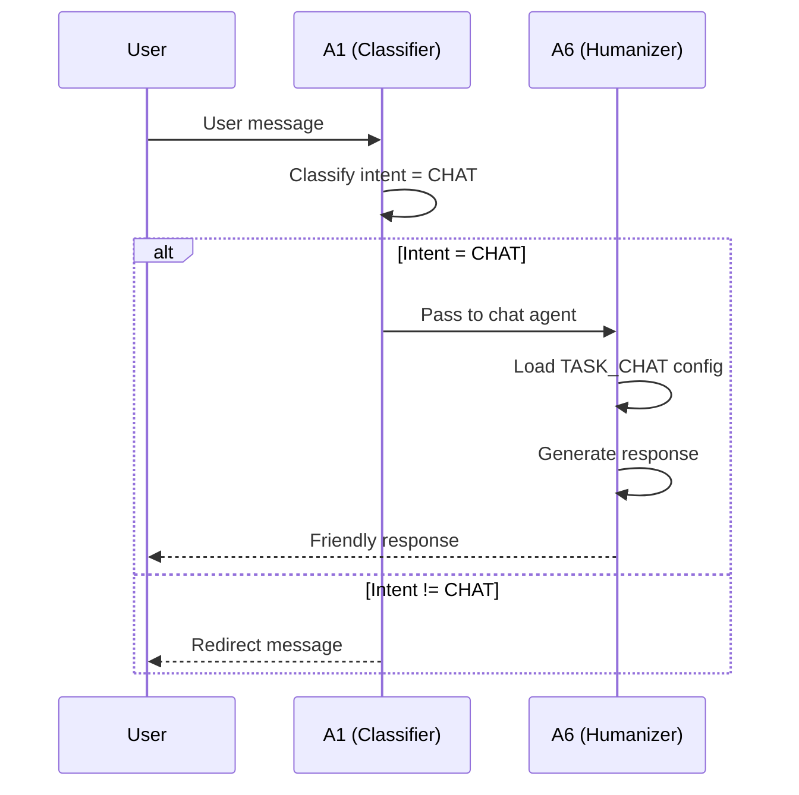
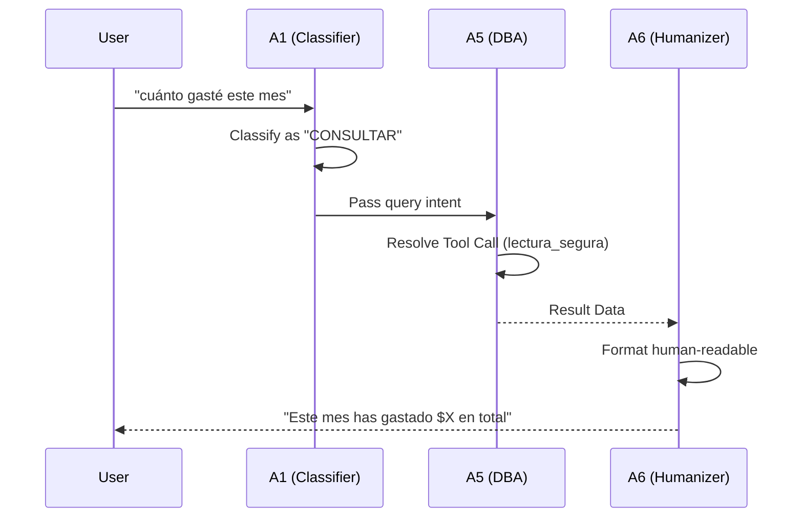
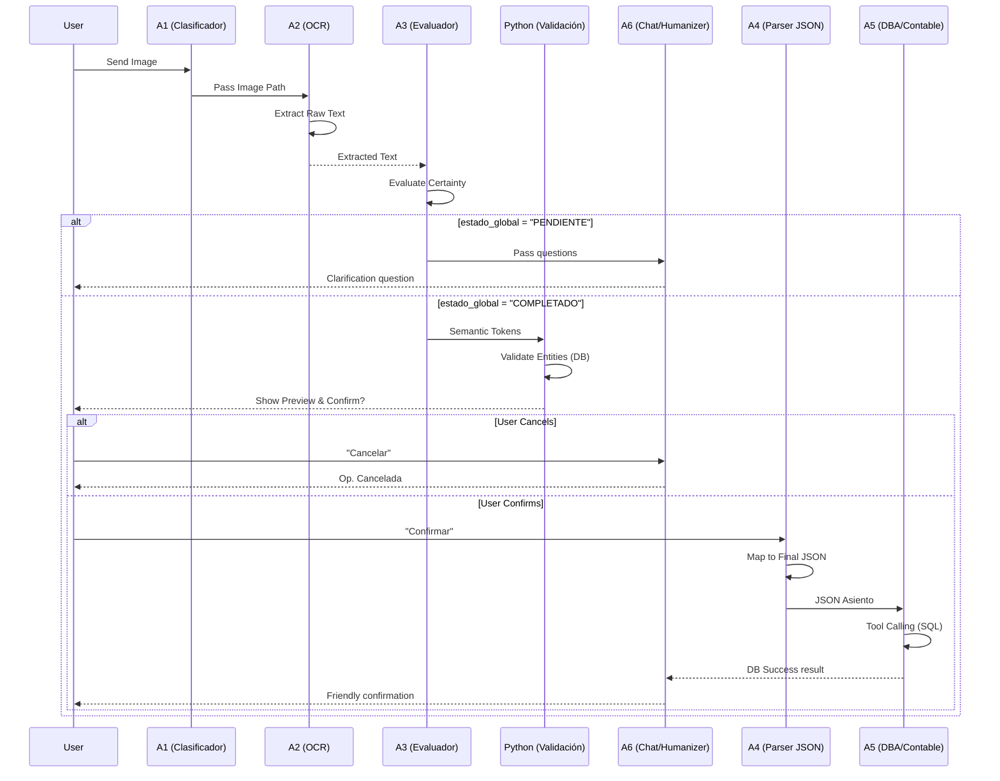
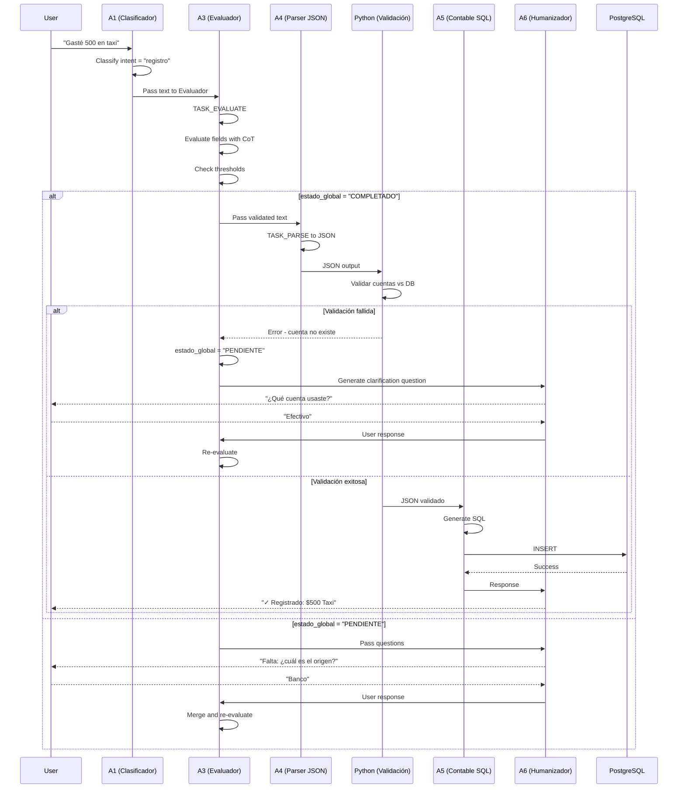
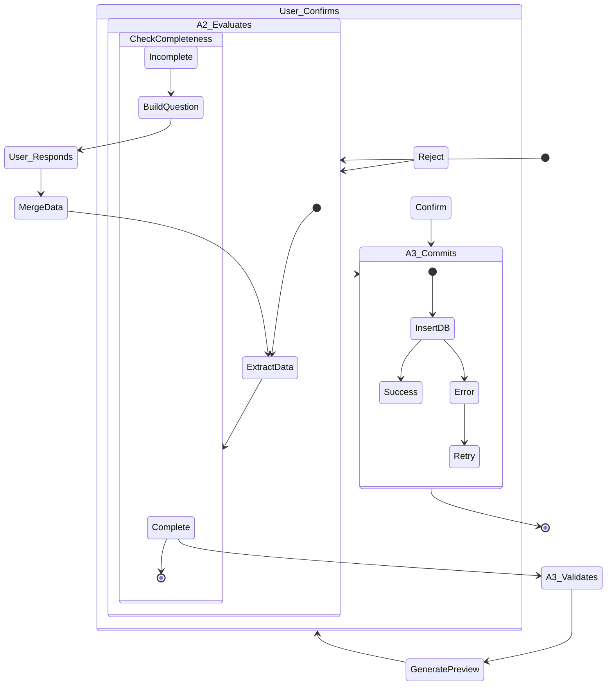
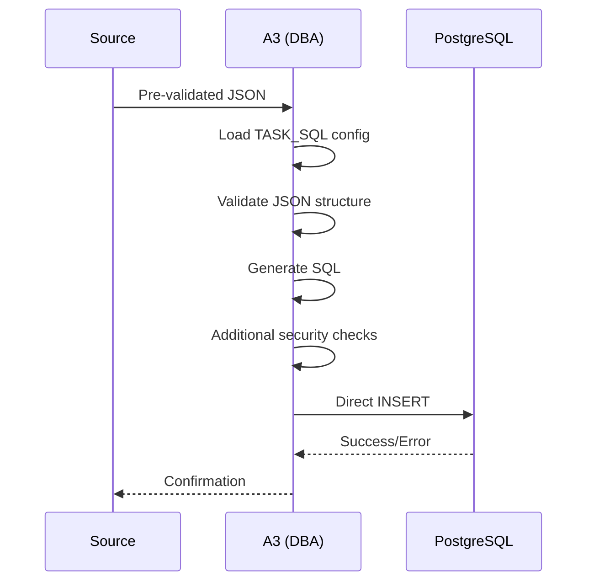
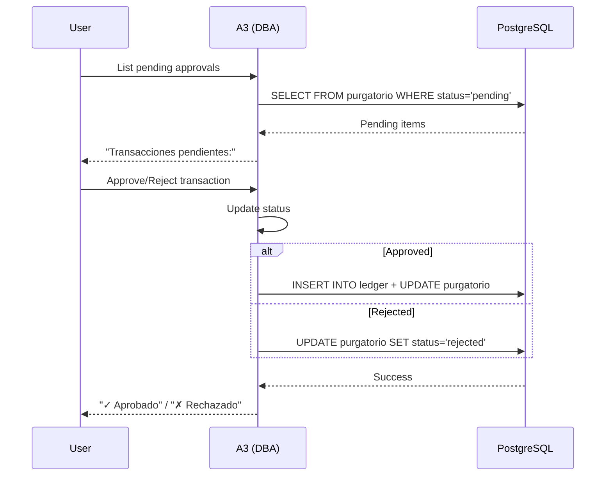
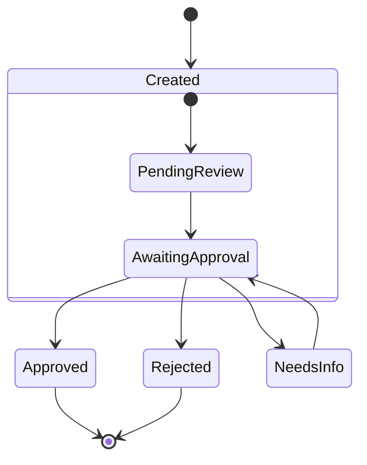
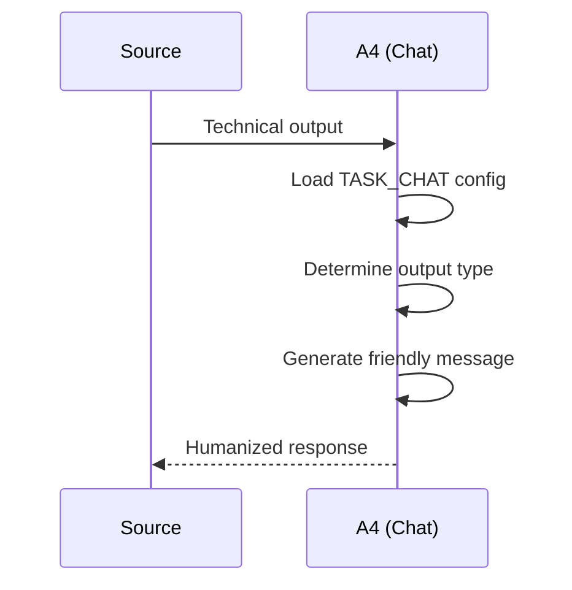
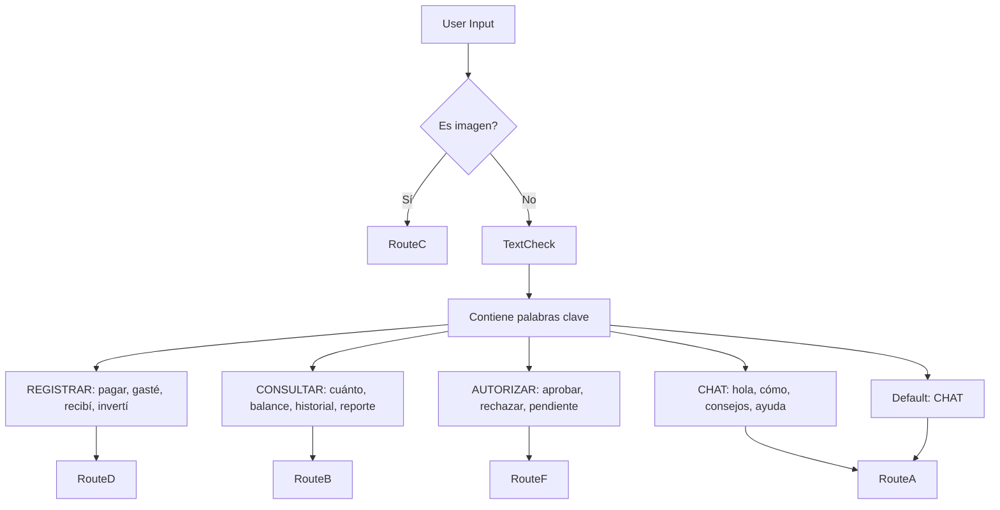

# System Routes - MyFinance 4.0

Detailed documentation for all processing routes in MyFinance 4.0.

---

## 1. Route Overview

### 1.1 Quick Reference Table (6 Agents)

| Route | Name | Agent Flow | Trigger | Database |
|-------|------|-----------|---------|----------|
| **A** | Chat/Asesoría | A1 → A6 | "Hola", questions, general chat | Read-only |
| **B** | SQL Query | A1 → A5 → A6 | Balance queries, reports | Read |
| **C** | Image (OCR) | A1 → A2 → A3 → Python → A4  → A5 → A6 | Receipt/invoice photos | Write |
| **D** | Text Registration | A1 → A3 → Python → A4  → A5 → A6 | "Pagué...", "Recebí..." | Write |
| **E** | Direct Execution | A4 → A5 | Pre-validated JSON | Write |
| **F** | Authorization | A5 → A6 | Purgatorio approval | Write |

### 1.2 Routing Logic Summary (6 Agents)

```
User Input
    │
    ▼
┌─────────────┐
│   A1       │ ──▶ Classify Intent (TASK_CLASSIFY)
│ Clasificador│
└─────────────┘
    │
    ├── "CHAT" ──────▶ Route A (A1 → A6)
    │
    ├── "CONSULTAR" ─▶ Route B (A1 → A5 → A6)
    │
    ├── "REGISTRAR" ──┼── Image ──▶ Route C (A1→A2→A3→A4→PY→A5→A6)
    │                 └── Text ───▶ Route D (A1→A3→A4→PY→A5→A6)
    │
    ├── "EJECUTAR" ──▶ Route E (A5)
    │
    └── "AUTORIZAR" ─▶ Route F (A5)
```

### 1.3 Pipeline de Registro (Route D)

```
A1 (Clasificador) → A2 (OCR) → A3 (Evaluador) → A4 (Parser) → Python(valida) → A5 (SQL) → A6 (Humanizador)
        TEXTO           TEXTO        EVAL           JSON         CUENTAS          SQL         APROB
```

---

## 2. Route A: Chat/Asesoría

### 2.1 Description

Route A handles free-form conversation and financial advice. The system provides:
- General financial guidance
- Expense analysis
- Budget recommendations
- Account information

**When to use:**
- Greetings ("Hola", "¿cómo estás?")
- General questions about finances
- Advice requests ("¿cómo debo manejar mi presupuesto?")
- Non-transactional conversations

### 2.2 Flow Diagram



### 2.3 Input Specification

**Message Types:**
- Text (Spanish/English)
- Maximum length: 4000 tokens

**Example Inputs:**
```
"Hola, ¿cómo estás?"
"¿Cuál es mi situación financiera?"
"¿Cómo puedo ahorrar más?"
"¿Qué consejos me das para manage mis gastos?"
```

### 2.4 Output Specification

**Response Format:**
```json
{
  "response": "string (user-friendly message)",
  "type": "chat",
  "actions": []
}
```

**Response Examples:**
```
"Hola! Soy tu asistente financiero. ¿En qué puedo ayudarte hoy?"

"Tu situación actual muestra que has gastado $12,500 este mes. 
Esto representa el 78% de tu presupuesto mensual. ¿Quieres recomendaciones?"

"Para mejorar tu ahorro, te sugiero: 
1. Crear una cuenta de ahorro automática
2. Implementar la regla 50/30/20
3. Revisar suscripciones innecesarias"
```

### 2.5 Example Interactions

**Example 1: Greeting**
```
User: Hola
System: ¡Hola! Soy tu asistente financiero MyFinance. 
        Puedo ayudarte a registrar gastos, consultas de saldo, 
        y darte asesoría financiera. ¿En qué puedo ayudarte?
```

**Example 2: Financial Advice**
```
User: ¿Cómo debería organizar mi presupuesto?
System: Te sugiero la regla 50/30/20:
        • 50% necesidades (alquiler, servicios, alimentación)
        • 30% deseos (entretenimiento, suscripciones)
        • 20% ahorro e inversión
        
       ¿Te gustaría que te ayude a implementar este sistema?
```

### 2.6 Error Handling

| Error | Cause | Resolution |
|-------|-------|------------|
| Empty response | LLM API failure | Retry with exponential backoff |
| Token limit exceeded | Message too long | Summarize previous context |
| Rate limit | API throttling | Queue with delay |
| Off-topic message | Misclassification | Redirect to chat with notice |

### 2.7 Agent Configuration

| Agent | Model | Timeout | Retry |
|-------|-------|---------|-------|
| A1 (Classifier) | MODELO_A1 | 30s | 2 |
| A6 (Chat) | MODELO_A6 | 60s | 3 |

---

## 3. Route B: SQL Query

### 3.1 Description

Route B generates and executes SQL queries based on natural language questions about financial data.

**When to use:**
- Balance queries ("¿cuánto tengo en...?")
- Transaction history ("¿qué gasté en...?")
- Reports ("dame un reporte de...")
- Date-based queries ("este mes", "el año pasado")

### 3.2 Flow Diagram



### 3.3 Input Specification

**Message Types:**
- Text queries about financial data
- Maximum length: 2000 tokens

**Example Inputs:**
```
"¿cuánto gasté este mes?"
"dame mi balance de ahorros"
"¿qué transacciones hice la semana pasada?"
"muéstrame los gastos de comida de febrero"
"¿cuánto income tengo registrado?"
```

### 3.4 Output Specification

**Response Format:**
```json
{
  "response": "string (human-readable)",
  "type": "query",
  "data": {
    "sql": "SELECT ...",
    "results": [],
    "summary": "string"
  }
}
```

**Response Examples:**
```
"Este mes (Marzo 2026) has gastado un total de $45,230 en:

• Alimentación: $12,450 (27.5%)
• Transporte: $8,200 (18.1%)
• Servicios: $7,580 (16.8%)
• Entretenimiento: $5,000 (11.1%)
• Otros: $12,000 (26.5%)"
```

### 3.5 Example Interactions

**Example 1: Monthly Balance**
```
User: ¿cuánto gasté en febrero?
System: En Febrero 2026, tus gastos fueron:
        
        Ingresos: $85,000
        Gastos: $42,350
        Balance: $42,650
        
        Principales categorías:
        • Alimentación: $15,200
        • Servicios: $12,500
        • Transporte: $8,650
        • Otros: $6,000
```

**Example 2: Category Search**
```
User: ¿cuánto gasté en uber?
System: Encontré 12 transacciones con 'uber' en Febrero 2026:
        
        Total Uber: $3,240
        
        Detalle:
        • 2026-02-01: $180
        • 2026-02-03: $245
        • ...
```

### 3.6 Error Handling

| Error | Cause | Resolution |
|-------|-------|------------|
| Invalid SQL | LLM generated invalid syntax | Regenerate with corrected schema |
| No results | Query too specific | Suggest broader search |
| Permission denied | User lacks access | Return access error |
| Query timeout | Large dataset | Add LIMIT clause |
| SQL injection attempt | Malicious input | Reject and log |

### 3.7 Agent Configuration

| Agent | Model | Timeout | Retry |
|-------|-------|---------|-------|
| A1 (Classifier) | MODELO_A1 | 30s | 2 |
| A5 (DBA) | MODELO_A5 | 45s | 2 |
| A6 (Chat) | MODELO_A6 | 30s | 2 |

---

## 4. Route C: Image (OCR)

### 4.1 Description

Route C processes invoice/receipt images through OCR and converts them to accounting entries.

**When to use:**
- User sends an image file
- Image contains financial data (receipts, invoices)
- Automatic extraction of amount, date, vendor

### 4.2 Flow Diagram



### 4.3 Input Specification

**Supported Formats:**
- JPEG (.jpg, .jpeg)
- PNG (.png)
- PDF (.pdf) - first page

**Image Requirements:**
- Minimum: 300x300 pixels
- Maximum: 10MB file size
- Text must be readable

**Example Inputs:**
```
[Image: Starbucks receipt - $450]
[Image: Walmart invoice - $2,350]
[Image: Netflix invoice - $15.99]
```

### 4.4 Output Specification

**Response Format:**
```json
{
  "response": "string",
  "type": "ocr_result",
  "data": {
    "extracted": {
      "monto": 450.00,
      "fecha": "2026-03-31",
      "proveedor": "Starbucks",
      "categoria": "alimentacion"
    },
    "accounting_entry": {
      "tipo": "gasto",
      "cuenta": "alimentacion",
      "monto": 450,
      "credito": false
    }
  }
}
```

**Response Examples:**
```
"✓ Receipt procesado:
  
  Starbucks
  Fecha: 31/03/2026
  Monto: $450.00
  Categoría: Alimentación
  
  ¿Confirmas el registro?"
```

### 4.5 Example Interactions

**Example 1: Receipt OCR**
```
User: [sends image of restaurant receipt]
System: ✓ Procesado:
        
        Proveedor: Restaurant El Gourmet
        Fecha: 31/03/2026
        Monto: $1,250.00
        Categoría: Alimentación (detectada)
        
        Registro contable:
        Dr. Alimentación $1,250
        Cr. Efectivo $1,250
        
        ¿Confirmas?
```

**Example 2: Invoice OCR**
```
User: [sends image of electricity bill]
System: ✓ Factura procesada:
        
        Empresa: CFE
        Fecha: 30/03/2026
        Monto: $890.50
        Vencimiento: 15/04/2026
        Categoría: Servicios
        
        ¿Registrar como gasto pendiente?
```

### 4.6 Error Handling

| Error | Cause | Resolution |
|-------|-------|------------|
| Unreadable image | Blurry/low quality | Request clearer image |
| No text detected | Empty receipt | Ask user to verify |
| Amount not found | Missing/invalid amount | Ask user for amount |
| Invalid format | Unsupported file type | Explain supported formats |
| File too large | Compress or resize | Request smaller file |

### 4.7 Agent Configuration

| Agent | Model | Timeout | Retry |
|-------|-------|---------|-------|
| A1 (Clasif) | MODELO_A1 | 30s | 2 |
| A2 (OCR) | MODELO_A2 (qwen2.5-vl) | 60s | 2 |
| A3 (Evaluador) | MODELO_A3 | 45s | 2 |
| A4 (Parser) | MODELO_A4 | 45s | 2 |
| A5 (DBA) | MODELO_A5 (qwen3.5:latest) | 30s | 2 |
| A6 (Chat) | MODELO_A6 (qwen3.5:latest) | 30s | 2 |

---

## 5. Route D: Text Registration

### 5.1 Description

Route D transforms natural language text into accounting entries. This is the primary registration route for expenses/income.

**When to use:**
- Text descriptions of transactions
- "Pagué...", "Recebí...", "Gasté en..."
- Expense/income notifications

### 5.2 Flow Diagram (6 Agents)




### 5.3 TASK_EVALUATE (Agente A3)

El Agente A3 (Evaluador Semántico) evalúa coherencia de datos:

```json
{
  "_razonamiento_previo": "string (Análisis de extracción)",
  "campos": {
    "monto_total": {
      "valor": 500,
      "es_requerido": true,
      "certeza": 95,
      "accion": "siguiente",
      "pregunta": null
    },
    "origen": {
      "valor": "Banco",
      "es_requerido": true,
      "certeza": 80,
      "accion": "siguiente",
      "pregunta": null
    },
    "destino": {
      "valor": null,
      "es_requerido": true,
      "certeza": 0,
      "accion": "preguntar",
      "pregunta": "¿A dónde fue el gasto?"
    }
  },
  "estado_global": "PENDIENTE"
}
```

### 5.4 Validación de Cuentas y Categorías (Python)

La validación se hace en **Python** después de A4:

```python
def validar_cuentas(usuario_id, origen, destino):
    # Validar contra DB
    cuenta_origen = query("SELECT ... FROM cuentas WHERE nombre ILIKE :nombre", ...)
    cuenta_destino = query("SELECT ... FROM cuentas WHERE nombre ILIKE :nombre", ...)
    
    if not cuenta_origen:
        return {"error": "E001", "mensaje": "Cuenta origen no existe"}
    # ...
```

### 5.5 Threshold de Certeza

| Campo | Threshold | Acción si falla |
|-------|-----------|------------------|
| monto_total | ⚙️ Configurable | PENDIENTE |
| origen | ⚙️ Configurable | PENDIENTE |
| destino | ⚙️ Configurable | PENDIENTE |
| categoria | ⚙️ Configurable | PENDIENTE |

> Todos los thresholds son configurables desde el Panel de Control de Agentes

### 5.6 Tool Calling - Agente A5 (Contable SQL)

El Agente A5 usa herramientas para operar la base de datos de forma autónoma:

| Herramienta | Función |
|-------------|---------|
| `consultar_diccionario_datos` | Ver estructura de tablas |
| `ejecutar_lectura_segura` | SELECT de solo lectura (resolver UUIDs) |
| `ejecutar_transaccion_doble` | INSERT en transacción |

### Flujo con Tool Calling

```
1. Input: {monto: 500, origen: "Banco BHD", destino: "Supermercado"}
2. Tool "ejecutar_lectura_segura" → Obtener UUID de "Banco BHD"
3. Tool "ejecutar_lectura_segura" → Obtener UUID de "Supermercado"
4. Tool "ejecutar_transaccion_doble" → INSERT con UUIDs correctos
5. Output: {status: "success", transaction_id: "tx-999"}
```

### Panel de Control - Permisos de Herramientas

| Herramienta | Default |
|-------------|---------|
| `consultar_diccionario_datos` | ✅ Activa |
| `ejecutar_lectura_segura` | ✅ Activa |
| `ejecutar_transaccion_doble` | ✅ Activa |

**Modo Dry-Run:** Desactivar `ejecutar_transaccion_doble` para pruebas sin afectar la contabilidad real.

### 5.3 TASK_PARSE v3 Structure

Agent A2 uses a structured JSON output with Chain of Thought (CoT) to prevent hallucinations:

```json
{
  "_razonamiento_previo": "string (Forces model to declare what data was NOT found)",
  "entidades": {
    "monto": "number|null (subtotal antes de impuestos)",
    "monto_total": "number|null (total final)",
    "monto_impuesto": "number|null",
    "monto_descuento": "number|null",
    "monto_otros_cargos": "number|null",
    "moneda": "string|null",
    "fecha": "string|null (YYYY-MM-DD)",
    "concepto": "string|null",
    "origen": "string|null (de dónde sale el dinero)",
    "destino": "string|null (a dónde va el dinero)",
    "categoria": "string|null"
  },
  "certeza": "number (0-100)",
  "es_ambiguo": "boolean",
  "pregunta_aclaracion": "string|null"
}
```

**Required fields for PROCESAR:** `monto_total`, `origen`, `destino`

### 5.3 Input Specification

**Message Types:**
- Spanish text describing transactions
- Mixed with date/category information

**Example Inputs:**
```
"Pagué $150 en taxi al aeropuerto"
"Recebí $5000 de salary"
"Gasté 200 en supermercado"
"Pagué la luz de marzo $890"
```

### 5.4 Output Specification

**Response Format:**
```json
{
  "response": "string",
  "type": "registration",
  "data": {
    "accion": "PROCESAR | PREGUNTAR | ERROR",
    "datos_parciales": {},
    "preview": {}
  }
}
```

### 5.5 Example Interactions

**Example 1: Complete Registration**
```
User: Pagué $350 en la gasolinera
System: ✓ Gasto registrado:
        
        Cuenta: Gasolina
        Monto: $350.00
        Fecha: 31/03/2026
        Tipo: Gasto
        
        Asiento contable:
        Dr. Gastos de transporte $350
        Cr. Efectivo $350
```

**Example 2: Missing Data (Interactive)**
```
User: Pagué taxi
System: Necesito más detalles:
        
        □ Monto: ¿Cuánto pagaste?
        □ Fecha: ¿Cuándo?
        
        (Responder con los datos que conozcas)

User: 200 pesos
System: ✓ Completado:
        
        Cuenta: Taxi
        Monto: $200.00
        Fecha: 31/03/2026
        
        ¿Confirmas el registro?
```

### 5.6 Error Handling

| Error | Cause | Resolution |
|-------|-------|------------|
| Unclear amount | "pagué taxi" without amount | Ask for amount |
| Unknown category | Cannot determine account | Ask for category |
| Invalid date | Cannot parse date | Ask for date |
| Max attempts exceeded | >5 clarification attempts | Abort, request new message |

### 5.7 Agent Configuration

| Agent | Model | Timeout | Retry |
|-------|-------|---------|-------|
| A1 (Clasificador) | MODELO_A1 | 30s | 2 |
| A3 (Evaluador) | MODELO_A3 | 45s | 2 |
| A4 (Parser) | MODELO_A4 | 45s | 2 |
| A5 (DBA) | MODELO_A5 (qwen3.5:latest) | 45s | 2 |
| A6 (Chat) | MODELO_A6 (qwen3.5:latest) | 30s | 2 |

### 5.8 TASK_ASK Interactive Flow

Full state machine for interactive validation:



#### State Descriptions

| State | Description |
|-------|-------------|
| **A2_Evaluates** | Agent A2 extracts data from user message |
| **CheckCompleteness** | Validates all required fields present |
| **Complete** | All required data found |
| **Incomplete** | Missing required fields |
| **BuildQuestion** | Constructs question for missing data |
| **User_Responds** | User provides missing information |
| **MergeData** | Combines new data with partial data |
| **GeneratePreview** | Creates preview of accounting entry |
| **User_Confirms** | User approves or rejects preview |
| **A3_Validates** | Agent A3 validates SQL |
| **A3_Commits** | Final database insert |

#### Anti-Loop Mechanism

- **Maximum Attempts**: 5 question-response cycles
- **Counter**: Stored in `conversacion_pendiente.intentos`
- **On Exceed**: Abort registration, notify error, request new message
- **Reset**: Counter resets when user starts new conversation

---

## 6. Route E: Direct Execution

### 6.1 Description

Route E bypasses preview and confirmation, directly committing to the database.

**When to use:**
- Pre-validated accounting JSON
- Bulk imports
- Automated transactions
- Trusted internal processes

### 6.2 Flow Diagram



### 6.3 Input Specification

**Message Types:**
- Pre-validated JSON
- Must follow strict schema

**Example Inputs:**
```json
{
  "tipo": "gasto",
  "cuenta": "alimentacion",
  "monto": 1500.00,
  "fecha": "2026-03-31",
  "descripcion": "Supermercado Walmart",
  "credito": false
}
```

### 6.4 Output Specification

**Response Format:**
```json
{
  "response": "string",
  "type": "execution",
  "data": {
    "id": "uuid",
    "sql": "INSERT INTO...",
    "status": "success"
  }
}
```

### 6.5 Example Interactions

**Example 1: Bulk Import**
```
Source: [JSON array of transactions]
System: Procesando 50 transacciones...
        
        ✓ 50 insertadas exitosamente
        ✗ 0 errores
```

### 6.6 Error Handling

| Error | Cause | Resolution |
|-------|-------|------------|
| Invalid schema | JSON doesn't match | Reject with schema |
| SQL injection | Suspicious content | Reject and log |
| DB constraint | Duplicate/fk violation | Return specific error |
| Transaction fail | Rollback and notify | Detailed error log |

### 6.7 Agent Configuration

| Agent | Model | Timeout | Retry |
|-------|-------|---------|-------|
| A3 (DBA) | granite4/qwen3 | 60s | 1 |

### 6.8 Security Checks

Route E includes additional validation:
- Schema validation against TASK_PARSE
- Sanitization of all string inputs
- Rate limiting per source
- Audit logging for all transactions

---

## 7. Route F: Authorization

### 7.1 Description

Route F handles the approval workflow for pending transactions stored in "Purgatorio".

**When to use:**
- Transactions requiring manual approval
- Large amounts exceeding threshold
- Uncategorized expenses
- User-specific approval requirements

### 7.2 Flow Diagram



### 7.3 Input Specification

**Message Types:**
- Approval/rejection commands
- Transaction IDs

**Example Inputs:**
```
"aprobar tx_123"
"rechazar tx_456"
"aprobar todos"
"detalle tx_789"
```

### 7.4 Output Specification

**Response Format:**
```json
{
  "response": "string",
  "type": "authorization",
  "data": {
    "action": "approve|reject|list",
    "transaction_id": "string",
    "status": "success"
  }
}
```

### 7.5 Example Interactions

**Example 1: List Pending**
```
User: ¿qué tengo pendiente?
System: Tienes 3 transacciones pendientes:
        
        1. TaxiUber $245 - 28/03/2026
           ID: tx_001 - [Aprobar] [Rechazar]
        
        2. Restaurant $890 - 29/03/2026
           ID: tx_002 - [Aprobar] [Rechazar]
        
        3. Servicio $1,200 - 30/03/2026
           ID: tx_003 - [Aprobar] [Rechazar]
```

**Example 2: Approve**
```
User: aprobar tx_002
System: ✓ Transacción aprobada
        
        Restaurant $890 - 29/03/2026
        Estado: Movido a Ledger
        
        Tu balance actual:
        Ingresos: $85,000
        Gastos: $43,240
        Balance: $41,760
```

### 7.6 Error Handling

| Error | Cause | Resolution |
|-------|-------|------------|
| Invalid ID | Transaction not found | Show valid IDs |
| Already processed | Double approval | Notify current state |
| Permission denied | Not authorized | Check permissions |

### 7.7 Agent Configuration

| Agent | Model | Timeout | Retry |
|-------|-------|---------|-------|
| A3 (DBA) | granite4/qwen3 | 30s | 2 |

### 7.8 Purgatorio State Machine



#### State Descriptions

| State | Description | Next Actions |
|-------|-------------|--------------|
| **Created** | Initial state after parsing | Auto-transitions to PendingReview |
| **PendingReview** | Queued for review | User views details |
| **AwaitingApproval** | User decision pending | Approve/Reject/NeedsInfo |
| **Approved** | Confirmed, moves to Ledger | Terminal |
| **Rejected** | Denied, marked as rejected | Terminal |
| **NeedsInfo** | More information required | User provides info |

---

## 8. Route G: Humanizer

### 8.1 Description

Route G translates technical output (SQL results, errors, logs) into user-friendly language.

**When to use:**
- After any route completes
- Error message translation
- SQL result explanation
- System notification formatting

### 8.2 Flow Diagram



### 8.3 Input Specification

**Message Types:**
- SQL query results
- Error messages
- System logs
- Technical data

**Example Inputs:**
```
"SELECT account_id, SUM(amount) FROM ledger GROUP BY..."
Error: psycopg2.OperationalError: connection refused
[technical log output]
```

### 8.4 Output Specification

**Response Format:**
```json
{
  "response": "string (friendly)",
  "type": "humanized",
  "original_type": "error|query|log|system"
}
```

### 8.5 Example Interactions

**Example 1: SQL Result**
```
Source: [{"mes": "enero", "total": 15000}, {"mes": "febrero", "total": 12000}]
System: Aquí está el resumen de tus gastos:
        
        • Enero: $15,000
        • Febrero: $12,000
        
        Comparing los dos meses, gastaste $3,000 menos en febrero.
```

**Example 2: Error**
```
Source: Error: Database connection failed
System: Ups, tuve un problema para conectar a la base de datos.
        
        Esto suele ser temporal. Por favor intenta de nuevo en unos segundos.
        
        Si el problema persiste, contacta al administrador.
```

### 8.6 Error Handling

| Error | Cause | Resolution |
|-------|-------|------------|
| Unparsable input | Cannot identify type | Return generic friendly message |
| Empty input | No content to humanize | Request input |

### 8.7 Agent Configuration

| Agent | Model | Timeout | Retry |
|-------|-------|---------|-------|
| A4 (Chat) | granite4/qwen3 | 30s | 2 |

---

## 9. Route Decision Matrix

### 9.1 A5 Classifier Logic

The classifier analyzes user input to determine the appropriate route:



### 9.2 Priority Rules

| Priority | Rule | Route |
|----------|------|-------|
| 1 | Image input | C |
| 2 | Explicit "aprobar/rechazar" | F |
| 3 | Transaction keywords | D |
| 4 | Query keywords | B |
| 5 | Greeting/advice | A |

### 9.3 Fallback Behavior

If classifier cannot determine intent with confidence > 0.7:
- Default to Route A (Chat)
- User receives: "No entiendo, ¿podrías reformular?"

### 9.4 Confidence Thresholds

| Confidence | Action |
|------------|--------|
| > 0.9 | Auto-route |
| 0.7 - 0.9 | Route with notice |
| < 0.7 | Default to Chat |

---

## 10. Route C & D con A3 - Evaluador Semántico

### 10.1 Nuevo Pipeline (6-Agentes Actualizado)

```
┌─────────────────────────────────────────────────────────────────────────┐
│                    FLUJO DE REGISTRO CON A3                            │
├─────────────────────────────────────────────────────────────────────────┤
│                                                                         │
│  INPUT: Texto o Imagen/PDF                                             │
│       │                                                                │
│       ▼                                                                │
│  ┌─────────────┐    ┌─────────────┐    ┌─────────────┐                │
│  │ A1 (Clasif) │───▶│ A2 (OCR)    │───▶│ A3 (Eval)   │                │
│  │ Solo texto  │    │ Imagen/PDF   │    │ Evaluador   │                │
│  └─────────────┘    └─────────────┘    └──────┬──────┘                │
│                                               │                        │
│                                               ▼                        │
│                              ┌────────────────────────────┐             │
│                              │  PARA CADA CAMPO:          │             │
│                              │  ¿Certeza < threshold?     │             │
│                              └─────────────┬──────────────┘             │
│                                          │                              │
│                                         SÍ                              │
│                                          │                              │
│                              ┌───────────▼───────────┐                  │
│                              │  TOOL CALLING (async) │                  │
│                              │  buscar_entidad()     │                  │
│                              └───────────┬───────────┘                  │
│                                          │                              │
│                       ┌──────────────────▼──────────────────┐          │
│                       │  EMBUDO DE VALIDACIÓN (Python)     │          │
│                       │  1. Normalización (strip, lower)    │          │
│                       │  2. Búsqueda Exacta (ILIKE)         │          │
│                       │  3. Búsqueda Vectorial (pgvector)  │          │
│                       │  4. Resolución de Falla           │          │
│                       └───────────────────┬────────────────┘          │
│                                           │                            │
│                       ┌────────────────────▼────────────────┐          │
│                       │  A3: estado_global =              │          │
│                       │  COMPLETADO o PENDIENTE           │          │
│                       └──────────────┬─────────────────────┘          │
│                                      │                                │
│                                      ▼                                │
│                              ┌──────────────┐                         │
│                              │ A6 (Chat)    │                         │
│                              │ Humanizador  │                         │
│                              │ Agrupa ?'s   │                         │
│                              └──────┬───────┘                         │
│                                     │                                 │
│                                     ▼                                 │
│                              ┌──────────────┐                         │
│                              │ A5 (SQL)    │                         │
│                              │ Tool Exec   │                         │
│                              └─────────────┘                         │
│                                                                         │
└─────────────────────────────────────────────────────────────────────────┘
```

### 10.2 Campos de Evaluación A3 (12 Campos)

| Campo | Threshold | Requerido | Evaluación |
|-------|-----------|-----------|------------|
| **monto_total** | ✅ Configurable | ✅ SÍ | Semántica |
| **monto** | ✅ Configurable | ❌ NO | Semántica |
| **monto_impuesto** | ✅ Configurable | ❌ NO | Semántica |
| **monto_descuento** | ✅ Configurable | ❌ NO | Semántica |
| **monto_otros_cargos** | ✅ Configurable | ❌ NO | Semántica |
| **origen** | ✅ Configurable | ✅ SÍ | Semántica |
| **destino** | ✅ Configurable | ✅ SÍ | Semántica |
| **categoria** | ✅ Configurable | ❌ NO | Semántica |
| **moneda** | ✅ Configurable | ❌ NO | Semántica |
| **fecha** | ✅ Configurable | ❌ NO | Semántica |
| **concepto** | ✅ Configurable | ❌ NO | Semántica |
| **descripcion** | ❌ N/A | ❌ NO | **Contexto** (sin threshold) |

### 10.3 Embudo de Validación (Tool Calling)

```
TOKEN: "BHD", "Luz", "0P"
    │
    ▼
┌─────────────────────────────┐
│  A3 (Evaluador)            │
│  Evalúa certeza del token  │
└──────────────┬──────────────┘
               │
               ▼
    ┌─────────────────────────┐
    │ ¿Certeza < threshold?  │
    └────────────┬────────────┘
        │                   │
       SÍ                  NO
        │                   │
┌──────▼──────┐         ┌─────────────┐
│ Tool Call   │         │ COMPLETADO  │
│ buscar_      │         │ (continuar) │
│ entidad()   │         └─────────────┘
└──────┬──────┘
       │
       ▼
┌─────────────────────────────┐
│ EMBUDO (Python)            │
│ 1. Normalización            │
│    strip(), lower()         │
├─────────────────────────────┤
│ 2. Búsqueda Exacta          │
│    SELECT WHERE ILIKE      │
├─────────────────────────────┤
│ 3. Búsqueda Vectorial       │
│    pgvector (cosine sim)    │
├─────────────────────────────┤
│ 4. Resolución de Falla     │
│    → PENDIENTE / SKIP      │
└──────────────┬──────────────┘
               │
               ▼
    ┌─────────────────────────┐
    │ RETURN:                 │
    │ {status, uuid,          │
    │  match_confidence,      │
    │  opciones_sugeridas}   │
    └─────────────────────────┘
```

### 10.4 Lógica de Estados

| Estado | Condición | Acción |
|--------|-----------|--------|
| **COMPLETADO** | Todos los campos requeridos con certeza ≥ threshold | Avanzar a A4 (Parser) |
| **PENDIENTE** | Al menos un campo con certeza < threshold y es requerido | A6 pregunta al usuario |
| **SKIP** | Campo no requerido y no encontrado | Asignar null, continuar |

### 10.5 Modo Interactivo

1. **A3 detecta PENDIENTE** → guarda en `conversacion_pendiente`
2. **A6 agrupa preguntas** → una sola interacción con el usuario
3. **Usuario responde** → re-envía a A3 para re-evaluación
4. **Límite**: 5 intentos máximo

### 10.6 Routing: OCR sin Clasificador

| Input | Flujo |
|-------|-------|
| **Texto** | A1 (Clasificador) → determina ruta → agentes |
| **Imagen/PDF** | A2 (OCR) directo → A3 → sin pasar por A1 |

---

## 11. Configuración por Usuario

### 11.1 Estructura de Configuración

La configuración se almacena en `usuarios.config` (JSONB):

```json
{
  "agentes": {
    "A3": {
      "thresholds": {
        "monto_total": 70,
        "monto": 50,
        "monto_impuesto": 50,
        "monto_descuento": 50,
        "monto_otros_cargos": 50,
        "origen": 60,
        "destino": 60,
        "categoria": 50,
        "moneda": 80,
        "fecha": 70,
        "concepto": 50
      },
      "requeridos": {
        "monto_total": true,
        "origen": true,
        "destino": true
      }
    },
    "A1": {
      "modelo": "qwen2.5-coder:7b",
      "temperatura": 0.3,
      "max_tokens": 100,
      "timeout": 30
    },
    "A2": { ... },
    "A3": { ... },
    "A4": { ... },
    "A5": { ... },
    "A6": { ... }
  },
  "herramientas": {
    "buscar_entidad": true,
    "buscar_cuenta": true,
    "buscar_categoria": true,
    "resolver_moneda": true,
    "modo_dry_run": false
  }
}
```

### 11.2 Defaults del Sistema (sistema_config)

Si el usuario no tiene configuración personalizada, se usan los defaults:

| Clave | Descripción |
|-------|-------------|
| `DEFAULT_CERTEZA_MONTO_A3` | Threshold default para monto |
| `DEFAULT_REQUERIDO_MONTO_A3` | Default requerido monto |
| `DEFAULT_MODELO_A1` | Modelo default A1 |
| `DEFAULT_TEMP_A1` | Temperatura default A1 |
| `DEFAULT_MAX_TOKENS_A1` | Max tokens A1 |
| `DEFAULT_TIMEOUT_A1` | Timeout A1 (segundos) |
| `TASK_EVALUATE` | Prompt zero-shot para A3 |

---

## Related Documentation

- [System Design](../architecture/system-design.md) - High-level architecture
- [AGENTS.md](../../AGENTS.md) - Complete 6-agent architecture documentation
- [TASK_ASK Flow](./decision-trees.md) - Classifier logic details
- [Database Schemas](../data-models/schemas.md) - Table structures

---

*Last updated: 2026-04-02*
