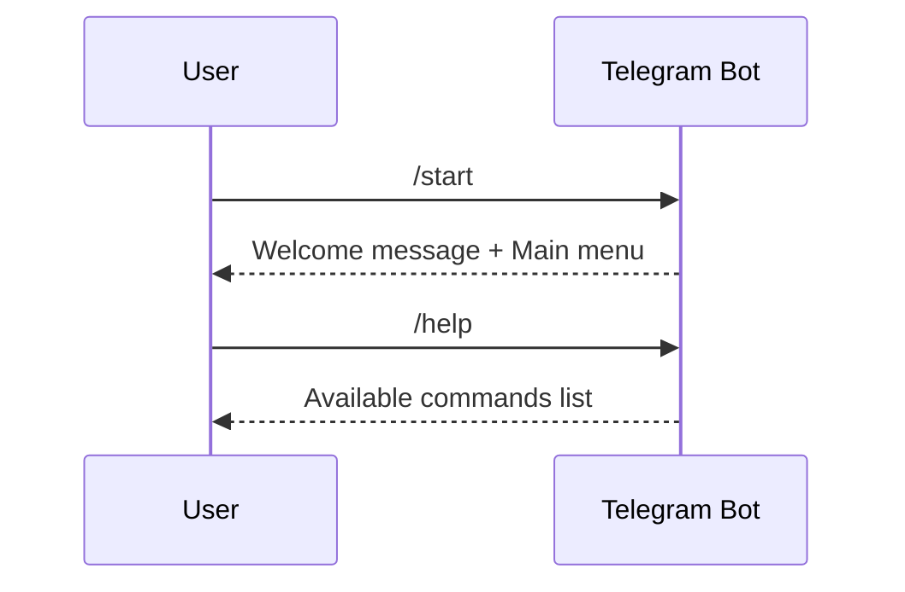
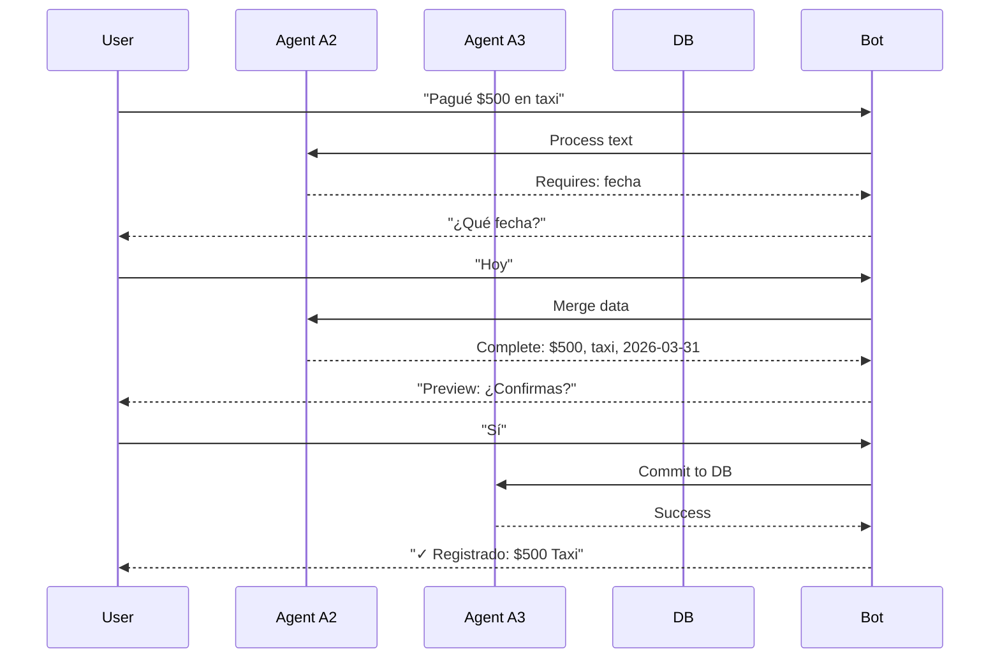
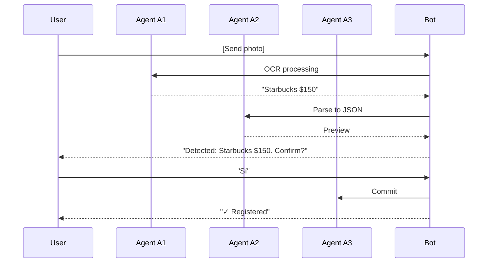
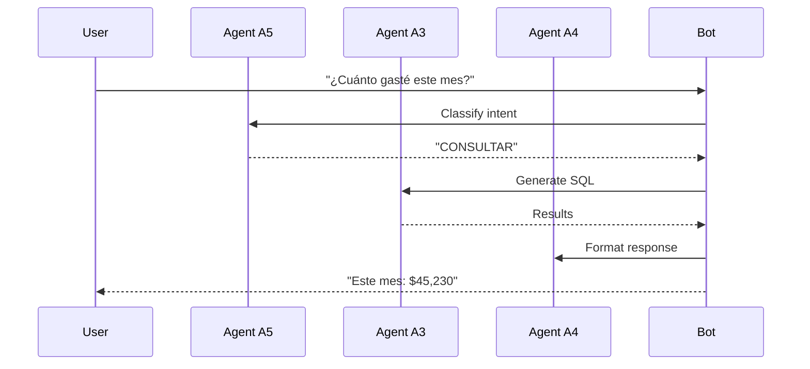
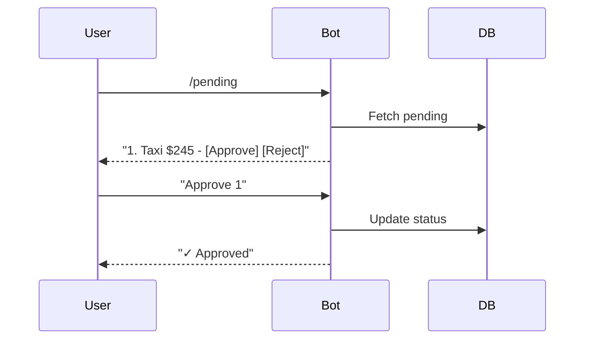
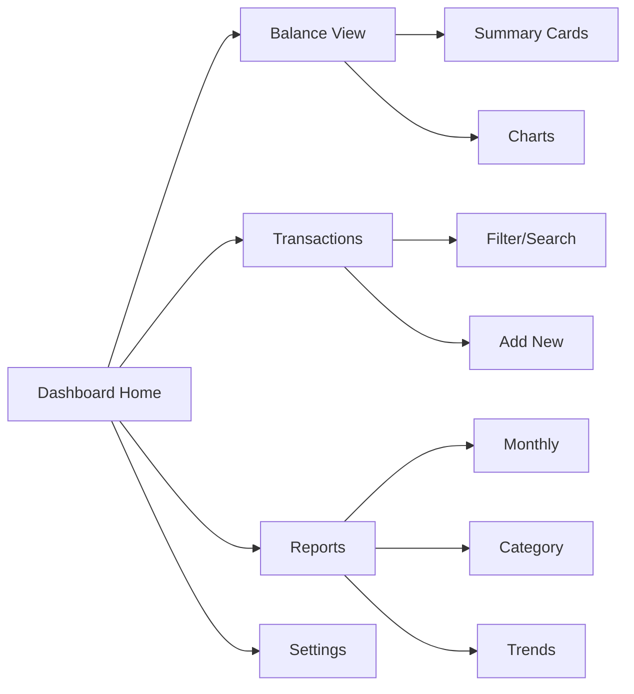
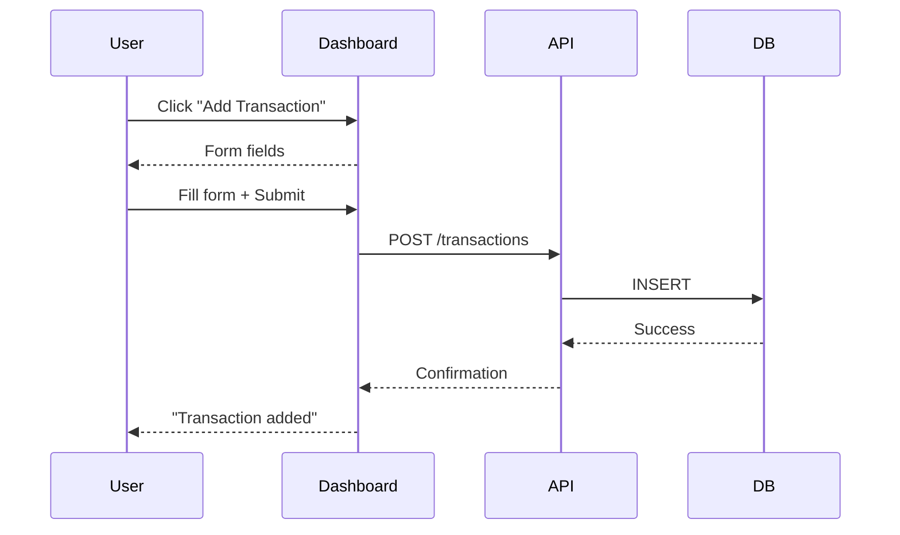
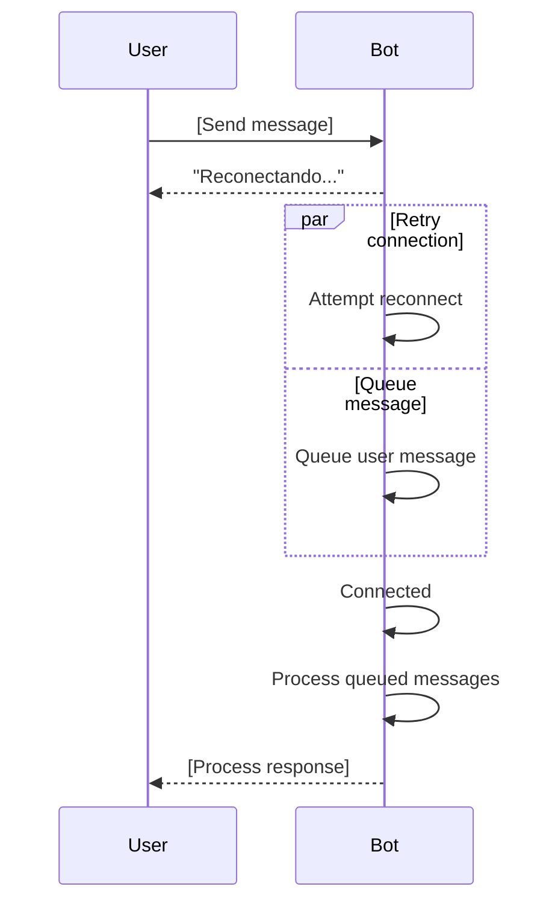

# User Flows - MyFinance 4.0

Documentation of how users interact with MyFinance through different interfaces.

---

## 1. Interface Overview

MyFinance supports two primary user interfaces:

| Interface | Purpose | Access |
|-----------|---------|--------|
| **Telegram Bot** | Primary interaction channel | @MyFinanceBot |
| **Streamlit Dashboard** | Visual analytics and reports | Localhost:8501 |

---

## 2. Telegram Bot Flows

### 2.1 Getting Started



#### Commands

| Command | Description |
|---------|-------------|
| `/start` | Initialize bot, show welcome |
| `/help` | Show available commands |
| `/status` | Show current balance |
| `/pending` | Show pending approvals |
| `/cancel` | Cancel current operation |

### 2.2 Registration Flow (Text)



### 2.3 Registration Flow (Image)



### 2.4 Query Flow



### 2.5 Approval Flow



---

## 3. Streamlit Dashboard Flows

### 3.1 Dashboard Overview



### 3.2 Main Views

| View | Description |
|------|-------------|
| **Home** | Dashboard overview with summary cards |
| **Transactions** | List, filter, add transactions |
| **Reports** | Charts and analytics |
| **Settings** | Configuration and preferences |

### 3.3 Adding Transaction (Dashboard)



---

## 4. Conversation Patterns

### 4.1 Natural Language Patterns

#### Expense Registration
| Pattern | Example |
|---------|---------|
| Direct amount | "Gasté $500 en taxi" |
| With date | "Pagué $200 hace 2 días" |
| With category | "Compré comida por $150" |
| Split payment | "Pagamos $300 entre 3" |

#### Income Registration
| Pattern | Example |
|---------|---------|
| Salary | "Recibí salary $50,000" |
| Freelance | "Me pagaron $5,000 por consulting" |
| Refund | "Me reembolsaron $200" |

#### Queries
| Pattern | Example |
|---------|---------|
| Balance | "¿Cuánto tengo en el banco?" |
| Period | "¿Cuánto gasté en enero?" |
| Category | "¿Cuánto en comida este mes?" |
| Comparison | "¿Gasté más o menos que el mes pasado?" |

### 4.2 Interactive Patterns

#### Clarification Requests
```
User: Pagué taxi
System: Necesito más detalles:
        □ Monto: ¿Cuánto pagaste?
        □ Fecha: ¿Cuándo?
User: 250 pesos
System: □ Fecha: ¿Cuándo?
User: Hoy
System: Listo! Confirmo:
        Taxi - $250 - Hoy
        ¿Confirmas?
```

#### Confirmation Flow
```
System: Preview del registro:
        Cuenta: Taxi
        Monto: $250
        Fecha: 31/03/2026
        
        [Confirmar] [Editar] [Cancelar]
```

---

## 5. Input Formats

### 5.1 Supported Formats

#### Text
- Spanish language (primary)
- English (supported)
- Mixed languages

#### Image
- JPEG (.jpg, .jpeg)
- PNG (.png)
- PDF (first page only)

#### Commands (Telegram)
- `/command` - Slash commands
- Inline buttons - Quick actions

### 5.2 Date Formats

| Format | Example | Accepted |
|--------|---------|----------|
| Relative | "hoy", "ayer", "la semana pasada" | ✓ |
| Numeric | "31/03/2026", "2026-03-31" | ✓ |
| Text | "31 de marzo", "el lunes" | ✓ |

### 5.3 Amount Formats

| Format | Example | Accepted |
|--------|---------|----------|
| Mexican Pesos | "$500", "500 pesos", "$500.00" | ✓ |
| USD | "$500 USD", "500 dólares" | ✓ |
| Thousands | "$10k", "$10mil" | ✓ |

---

## 6. Error Recovery

### 6.1 User Error Scenarios

| Scenario | User Action | System Response |
|----------|-------------|-----------------|
| Wrong amount | "Editar" | Show edit form |
| Wrong category | "Cambiar categoría" | Show category picker |
| Wrong date | "Cambiar fecha" | Date picker |
| Cancel | "Cancelar" | Abort, show menu |

### 6.2 System Error Scenarios

| Scenario | System Response |
|----------|-----------------|
| OCR fails | "No pude leer la imagen. ¿Podrías enviar una más clara?" |
| DB error | "Tuve un problema técnico. Intenta de nuevo en unos segundos." |
| Timeout | "La operación tardó demasiado. ¿Querés intentar de nuevo?" |

---

## 7. Offline/Online Behavior

### 7.1 Online (Connected)

- Real-time processing
- Instant responses
- Live balance updates
- Push notifications

### 7.2 Offline (Reconnecting)



---

## 8. Multi-Session Behavior

### 8.1 Conversation Context

The system maintains context within a session:

```
Session: /start → Query → Registration → Query → /end

Context preserved:
✓ User identity
✓ Last transaction details
✓ Pending operations
✓ Conversation history

Context reset on:
✗ New /start command
✗ 30 minutes of inactivity
✗ Bot restart
```

### 8.2 Pending Operations

| State | Description | Timeout |
|-------|-------------|---------|
| **Awaiting amount** | Asked for missing amount | 5 min |
| **Awaiting date** | Asked for date | 5 min |
| **Awaiting confirmation** | Preview shown | 10 min |
| **Awaiting approval** | Purgatorio item | No timeout |

---

## Related Documentation

- [Routes](./routes.md) - Technical route details
- [Decision Trees](./decision-trees.md) - Classifier logic
- [System Design](../architecture/system-design.md) - Architecture overview

---

*Last updated: 2026-03-31*
